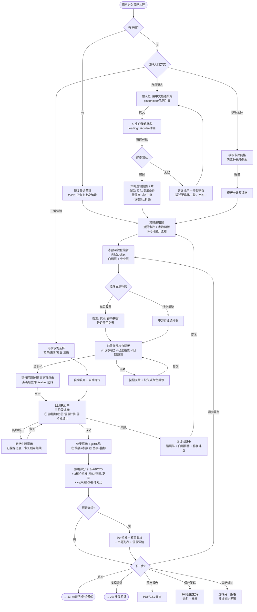
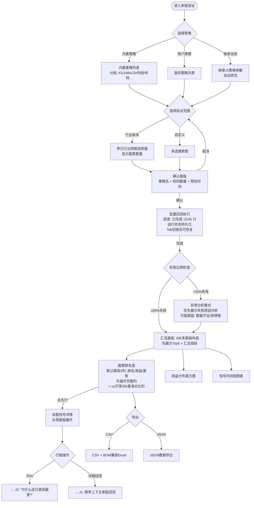
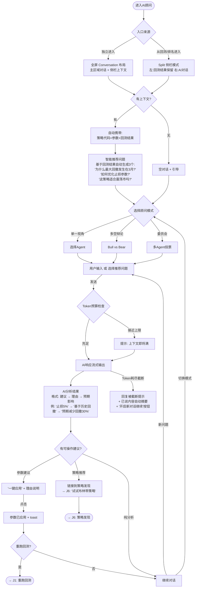
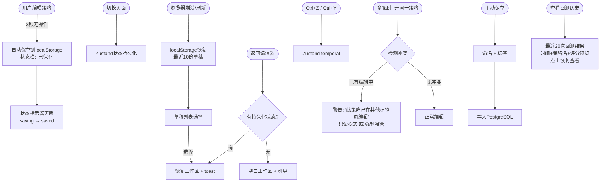
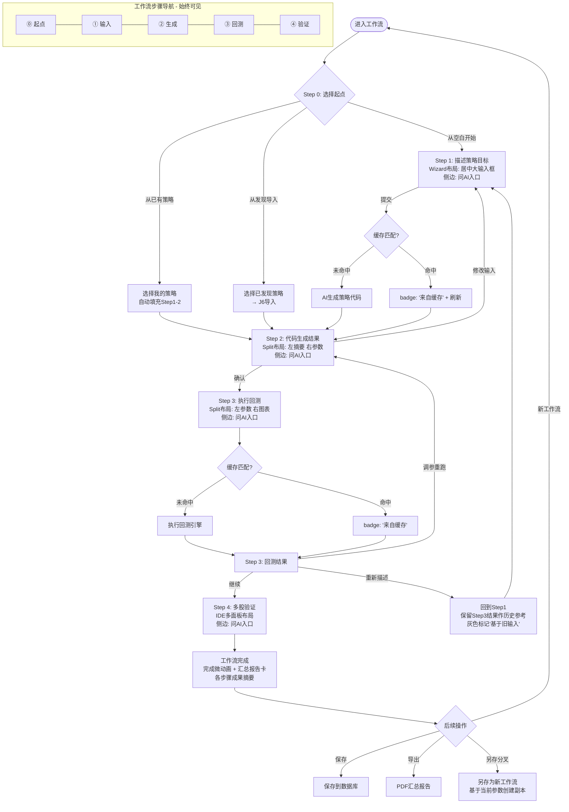
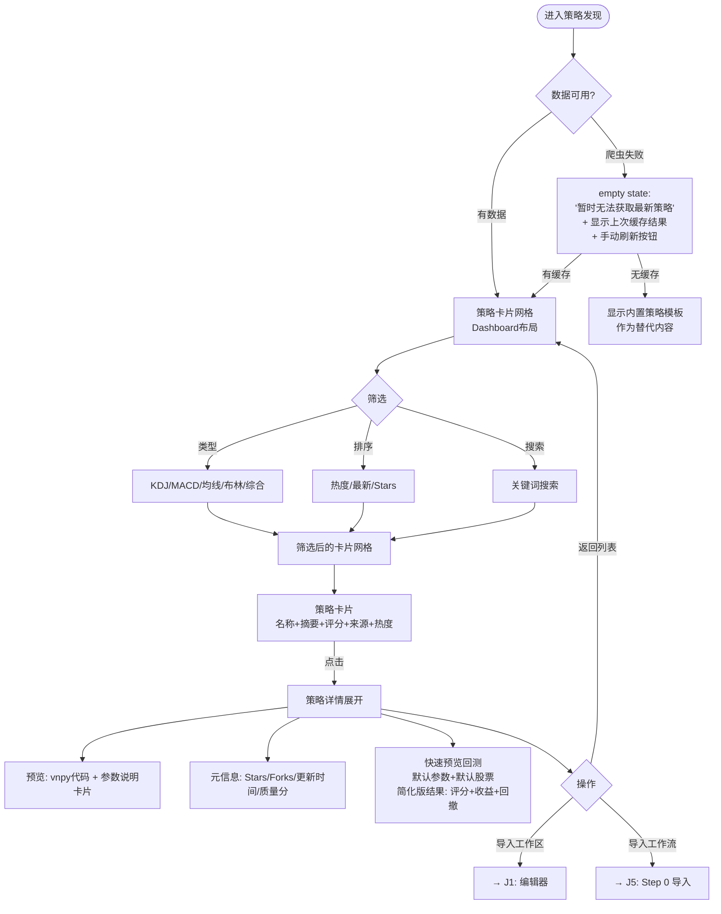

# UX Design Specification lurus-lucrum

**Author:** Anita
**Date:** 2026-02-02

---

<!-- UX design content will be appended sequentially through collaborative workflow steps -->

## Executive Summary

### Project Vision

Lucrum 是一个 AI 量化交易决策平台。其核心不是"提供量化工具"，而是"帮助用户做出更好的投资决策"。平台通过自然语言策略构建、金融级回测引擎、多视角 AI 顾问和自动策略发现，让非程序员也能进行专业级的策略验证。

设计哲学："量化交易员的驾驶舱" — 专业但不吓人，精密但可读，强大但有引导。

### Target Users

**策略设计者（核心用户）**
- 有投资经验，无编程能力
- 需要：逻辑可视化（非代码）、参数白话解释、核心指标优先
- 痛点：代码恐惧、指标过载、缺乏决策指引
- 入口偏好：从"投资想法"出发

**量化分析师（高级用户）**
- 专业技术背景，直接写代码
- 需要：数据控制权、完整导出、高级参数设置、辩论量化评分
- 痛点：控制深度不够、导出格式受限
- 入口偏好：从"策略代码"出发

**投资学习者（增长用户）**
- 零基础，探索阶段
- 需要：引导教程、示例场景、难度标签、默认AI推荐模式
- 痛点：不知从何开始、选择过多、缺乏学习路径
- 入口偏好：从"学习/浏览"出发

### Key Design Challenges

1. **渐进式复杂度**：同一界面服务三种用户，通过"深度可调"而非多套UI解决
2. **新手空白恐惧**：首次打开不能是空白编辑器，必须有预置示例和引导
3. **信息密度 vs 可读性**：30+ 回测指标需要分层披露（概要→关键→详细→原始）
4. **数据可信度**：模拟数据必须全局醒目标注，防止用户误信
5. **工作流可感知性**：4步工作流不能只是进度条，应作为主导航结构
6. **多入口汇聚**：用户可能从想法、股票或学习三种路径进入，必须汇聚到统一决策流
7. **AI 无处不在**：AI 顾问不是独立功能，应融入策略编辑、回测结果、异常提醒

### Design Opportunities

1. **对话式策略构建器**：替代空白文本框，问答引导生成策略
2. **策略评分系统 (S/A/B/C/D)**：比30个数字更直觉的策略质量判断
3. **AI 内嵌点评**：回测结果旁直接显示 AI 对该结果的解读
4. **策略逻辑可视化**：条件卡片替代代码预览，代码可折叠供高级用户
5. **三模式AI顾问**：快速问答 / 深度分析 / 多空辩论（替代11个Agent选择）
6. **先股后策反向流**：选好股票 → 系统推荐匹配策略
7. **回测前置条件清单**：运行按钮旁实时显示✅/❌条件状态
8. **模拟数据全局警告条**：黄色横幅贯穿界面，防止结果误导
9. **IDE 风格可折叠面板**：用户自定义工作区布局

### Information Architecture

L1 Navigation (主导航):
- 工作台 (Dashboard/Workspace) — 策略创建与工作流
- 验证中心 (Validation) — 多股验证与排名
- 策略市场 (Strategy Library) — 模板 + 热门发现
- AI 顾问 (Advisor) — 对话式投资分析

Platform Principles:
- 桌面端：完整编辑 + 分析体验（IDE 风格面板）
- 移动端 (<768px)：只读监控模式（结果查看 + 排名浏览）
- 组件四态统一：Loading / Empty / Error / Success

## Core User Experience

### Defining Experience

Lucrum 的核心体验循环：

    "我有一个投资想法" → "它有效吗？" → "我该怎么做？"

这三个问题定义了整个产品。所有功能都是这个循环的加速器：

- 自然语言输入 → 加速"想法表达"
- 回测引擎 → 回答"是否有效"
- AI 顾问 → 指导"怎么做"

核心循环的时间预算：从输入想法到看到可理解的结果 ≤ 15 秒。超过这个时间，用户的"好奇心窗口"关闭。

### Platform Strategy

| 维度 | 决策 | 理由 |
|------|------|------|
| 主平台 | Web (Desktop Browser) | 策略编辑和数据分析需要大屏空间 |
| 交互方式 | 键盘 + 鼠标为主 | 金融数据精确操作，触屏不适合 |
| 移动端 (<768px) | 只读监控模式 | 查看结果/排名/AI回复，不做策略编辑 |
| 离线 | 不需要 | 回测依赖服务端数据和AI，必须在线 |
| 设备能力 | 利用大屏多面板 | IDE 风格可折叠面板，用户自定义布局 |

布局架构：
- 桌面端 ≥ 1280px：多面板并排（编辑器 + 结果 + 顾问）
- 平板端 768-1279px：单面板 + 底部 Tab 切换
- 移动端 < 768px：卡片流 + 折叠面板，只读模式

### Effortless Interactions

以下交互必须"零思考成本"：

| 交互 | 当前状态 | 目标体验 |
|------|---------|---------|
| 策略输入 | 空白文本框 | 对话式引导 OR 模板一键选择 |
| 数据获取 | 自动（DB→API→模拟） | 完全透明，用户无感但知道数据来源 |
| 工作区保存 | 3秒自动保存 | 保持，增加可视状态指示 |
| 参数调整 | 滑块/输入框 | 增加白话影响说明 tooltip |
| 结果理解 | 30+ 指标一次展示 | 策略评分(S-D) + 3核心指标，详细可展开 |
| 缓存命中 | 静默返回 | 标注"来自缓存"，一键刷新 |

自动化原则：
- 代码生成：提交自然语言 → 自动生成 → 自动提取参数
- 数据准备：选择股票 → 自动检查DB → 自动回退API
- 结果缓存：相同参数 → 直接返回缓存结果
- 工作流推进：完成当前步骤 → 自动高亮下一步

### Critical Success Moments

**Moment 1: 首次体验（0-30秒）**
- 成功标志：用户在30秒内发起第一次回测（通过预置示例或引导）
- 失败标志：用户面对空白编辑器不知所措
- 设计要求：Onboarding 引导卡 + "一键体验"示例按钮

**Moment 2: 回测"啊哈"瞬间（按下运行后3秒内）**
- 成功标志：用户看到策略评分和核心指标，立刻理解结果好坏
- 失败标志：数字海洋、无法判断好坏、不信任数据
- 设计要求：评分系统 + 分层披露 + 数据源标注

**Moment 3: 迭代优化循环**
- 成功标志：用户修改参数 → 一键重跑 → 对比前后差异
- 失败标志：修改后找不到"重新运行"按钮，或无法看到变化
- 设计要求：参数修改后高亮变更 + 快速重跑 + 结果对比视图

**Moment 4: AI 顾问价值交付**
- 成功标志：AI 的建议让用户改进了策略参数，回测结果变好
- 失败标志：AI 回复太长/太泛/无法操作
- 设计要求：AI 建议附带"一键应用"按钮（调整参数）

### Experience Principles

1. **15秒法则**：从想法到结果不超过15秒。任何增加这个时间的设计都需要充分理由。
2. **深度可调，不是多套UI**：同一界面通过折叠/展开适配新手到专家，默认简洁，按需展开。
3. **数据必须可信**：每个数字都有来源标注，模拟数据有全局警告，精度用 Decimal.js 保证。
4. **AI 是副驾驶，不是独立应用**：AI 建议内嵌在用户操作的上下文中（回测旁、参数旁、异常时），而非独立页面。
5. **工作流即导航**：用户始终知道自己在"想法→生成→验证→决策"的哪一步，工作流步骤就是主导航结构。
6. **消灭空白**：任何页面、面板、状态都不允许空白无引导。Empty state = 引导 + 示例 + 建议操作。

## Desired Emotional Response

### Primary Emotional Goals

**核心情感**："被赋能的掌控感" — 用户感到"我虽然不懂代码，但我能做专业级的策略验证"。这不是简单的易用性，而是能力提升的自信感。

| 情感维度 | 目标 | 设计含义 |
|---------|------|---------|
| **信任** | 对数据和结果的绝对信任 | 数据源透明、Decimal.js 精度、模拟数据全局警告 |
| **掌控** | 始终知道自己在做什么 | 渐进式披露、工作流导航、前置条件清单 |
| **成就** | 每次回测都有明确的"我做得如何"反馈 | 策略评分(S-D)、与基准对比、进步可视化 |
| **好奇** | 想探索更多策略和参数组合 | AI 引导提问、模板推荐、"如果…会怎样"按钮 |

### Emotional Journey Mapping

| 阶段 | 用户心理 | 目标情感 | 避免情感 | 设计手段 |
|------|---------|---------|---------|---------|
| 首次发现 | "又一个量化工具？" | 好奇 + 低门槛邀请 | 被吓退 | 引导卡 + 一键示例 |
| 首次体验 | "真的能用？" | 惊喜 → "居然这么简单" | 困惑无从下手 | 预置模板 + 30秒内完成首次回测 |
| 核心回测循环 | "策略好不好？" | 清晰 + 信任 + 判断力 | 数字淹没 | 评分系统 + 分层指标 |
| 迭代优化 | "改参数会怎样？" | 掌控 + 探索欲 | 等待焦虑 | 快速重跑 + 变更高亮 + 对比视图 |
| AI 交互 | "你怎么看？" | 有同伴指导 | 被说教 | 对话式 + 可操作建议 + 一键应用 |
| 多股验证 | "策略普适吗？" | 专业感 + 洞察力 | 数据过载 | 排名表 + 汇总指标 + 虚拟滚动 |
| 出错时 | "怎么不行？" | 被保护 + 知道如何修复 | 慌张恐惧 | 友好错误消息 + 修复建议 + 自动保存 |
| 再次回来 | "继续上次的" | 无缝衔接 | 找不到之前工作 | 工作区恢复 + 最近草稿列表 |

### Micro-Emotions

**信任 > 怀疑** (金融平台第一优先级)
- 每个数字标注来源（DB/API/模拟）
- 模拟数据使用黄色全局警告条
- 精度通过 Decimal.js 保证，monospace + tabular-nums 排版强化专业感
- 错误代码体系 (BT1XX-BT9XX) 让问题可追溯

**掌控 > 困惑**
- 工作流步骤始终可见（"你在第2步/共4步"）
- 回测按钮旁前置条件清单（✅代码有效 ✅已选股票 ❌缺少日期）
- 参数白话 tooltip（"改为14意味着更少信号、更稳健"）

**成就 > 挫败**
- 策略评分给出即时反馈（S级 = 优秀，D级 = 需要改进）
- 每次迭代可视化进步（"比上次提升了 +12% 收益"）
- 完成工作流有仪式感（完成动画 + 汇总报告）

**好奇 > 焦虑**
- AI 对话式交互降低"问错问题"的压力
- "如果…会怎样"快捷按钮鼓励探索
- 策略推荐引导发现新可能

### Design Implications

| 情感目标 | UX 设计决策 |
|---------|------------|
| 信任 | 暗色专业界面 + monospace 数字 + 数据源徽章 + 全局模拟数据警告 |
| 掌控 | 工作流导航 + 前置条件清单 + 渐进式披露 + IDE 面板布局 |
| 成就 | 策略评分卡 + 迭代对比 + 工作流完成仪式 + 进步指标 |
| 好奇 | 对话式AI + 模板推荐 + "试试这个"引导 + 参数影响预览 |
| 安全 | 自动保存指示 + 友好错误页 + 撤销/重做 + 草稿列表恢复 |

### Emotional Design Principles

1. **信任优先于美观**：在信息准确性和视觉美观冲突时，永远选择准确。数据源标注比干净界面更重要。
2. **成就感来自理解，不是数量**：用户看懂3个指标比看到30个指标更有成就感。评分系统让"好坏"一目了然。
3. **AI 应该温暖但专业**：AI 顾问的语气是"资深同事给建议"而非"机器人输出报告"。建议可操作、语言人性化。
4. **错误是学习机会**：出错时不只显示错误消息，还提供"试试这个"的修复建议。每个 BT 错误代码附带白话解释。
5. **回来的感觉比第一次更好**：工作区恢复、草稿列表、最近操作 — 用户的每一份工作都被珍惜保存。

## UX Pattern Analysis & Inspiration

### Inspiring Products Analysis

#### TradingView — 图表交互标杆

**核心成功**：让复杂金融图表变得直觉化。用户不需要学习就能缩放、画线、叠加指标。
- **图表交互**：鼠标悬停即显十字光标 + 实时数据。缩放、拖拽完全无缝
- **指标叠加**：搜索式指标选择器，一键叠加到图表。参数即时可调
- **社区策略**：策略脚本公开分享，可一键复制到自己的图表
- **渐进式工具栏**：常用工具一级入口，高级工具折叠在分组菜单

**Lucrum 借鉴点**：K线图交互标准、指标叠加模式、策略社区浏览体验

#### VS Code — IDE 面板布局标杆

**核心成功**：在极高复杂度中保持可用性。多面板、多文件、多功能并行不混乱。
- **面板系统**：可拖拽、可折叠、可分屏。用户完全自定义工作区布局
- **命令面板 (Cmd+K)**：不记菜单位置也能找到任何功能。搜索式导航
- **侧边栏切换**：左侧栏在文件树/搜索/Git/扩展间一键切换
- **状态栏**：底部持续显示关键状态（分支、错误数、编码格式）
- **渐进式设置**：默认开箱即用，settings.json 给高级用户无限控制

**Lucrum 借鉴点**：可折叠面板布局、命令面板快捷操作、底部状态栏（保存状态/数据源/工作流步骤）

#### Cursor — AI 内嵌代码辅助标杆

**核心成功**：AI 不是独立工具，而是编辑器内的"副驾驶"。
- **内联建议**：AI 代码建议直接出现在光标位置，Tab 接受、Esc 忽略
- **对话面板**：侧边栏 AI 对话，可引用当前代码上下文
- **Apply 按钮**：AI 建议的修改可一键应用到代码中
- **上下文感知**：AI 自动理解当前文件和项目结构

**Lucrum 借鉴点**：AI 建议内嵌在策略编辑器中、回测结果旁的 AI 点评面板、"一键应用"参数调整建议

#### Notion — 信息架构与空状态标杆

**核心成功**：让复杂文档管理感觉像堆乐高积木。
- **空状态设计**：每个空页面都有引导——"Type '/' for commands"、模板选择器
- **Slash 命令**：/ 触发功能菜单，不需要记住任何按钮位置
- **渐进式披露**：简单页面和数据库用同一界面，复杂度按需展开
- **面包屑导航**：始终知道自己在哪里

**Lucrum 借鉴点**：空状态引导设计、Slash 命令式策略输入、面包屑式工作流导航

#### 聚宽 (JoinQuant) — 中国量化竞品

**优势**：成熟策略社区、完整回测框架、中文生态
**劣势（Lucrum差异化方向）**：
- 必须会 Python 才能使用 → Lucrum：自然语言输入
- 回测结果展示专业但不友好 → Lucrum：策略评分 + 分层披露
- 无 AI 投资顾问 → Lucrum：11 Agent 多视角分析
- 无工作流引导 → Lucrum：4步工作流导航
- 界面风格传统 → Lucrum：现代暗色驾驶舱

### Transferable UX Patterns

**导航模式**

| 模式 | 来源 | 适用场景 | 实现方式 |
|------|------|---------|---------|
| 命令面板 (Cmd+K) | VS Code | 快速跳转任何功能 | Radix UI Dialog + 搜索 |
| 面包屑工作流 | Notion | 显示当前工作流步骤位置 | 顶部栏：输入 > 生成 > 回测 > 验证 |
| 侧边栏模式切换 | VS Code | 切换编辑器/结果/顾问视图 | 左侧图标栏 + 面板切换 |
| 底部状态栏 | VS Code | 持续显示保存状态/数据源/步骤 | 固定底部栏 |

**交互模式**

| 模式 | 来源 | 适用场景 | 实现方式 |
|------|------|---------|---------|
| AI 内联建议 | Cursor | 策略编辑时的 AI 优化建议 | 代码行旁的建议气泡 |
| 一键应用 | Cursor | AI 顾问建议直接调整参数 | "应用此建议"按钮 |
| 十字光标悬停 | TradingView | K线图数据查看 | lightweight-charts 内置支持 |
| Slash 命令 | Notion | 策略输入替代方案 | /均线 /KDJ /止损 快捷指令 |
| 搜索式选择器 | TradingView | 股票搜索/指标选择 | Combobox + 模糊匹配 |

**视觉模式**

| 模式 | 来源 | 适用场景 | 实现方式 |
|------|------|---------|---------|
| 可折叠面板 | VS Code | 工作区自定义布局 | 拖拽分隔线 + 折叠按钮 |
| 暗色专业主题 | TradingView | 整体视觉基调 | 已有 DESIGN_SYSTEM.md |
| 空状态引导 | Notion | 首次使用/空面板 | 引导卡 + 模板推荐 + 示例按钮 |
| 渐进式工具栏 | TradingView | 回测参数面板 | 常用参数 + "高级设置"折叠 |

### Anti-Patterns to Avoid

| 反模式 | 来源教训 | Lucrum 风险 | 规避策略 |
|--------|---------|------------|---------|
| **Bloomberg 信息轰炸** | Bloomberg Terminal | 30+ 指标同时展示 | 分层披露 + 策略评分 |
| **聚宽代码门槛** | JoinQuant | 直接展示 Python 代码 | 逻辑可视化默认，代码折叠 |
| **过度定制化** | 某些 IDE 插件 | 面板太多太杂 | 3 种预设布局 + 自定义选项 |
| **AI 对话孤岛** | 早期 ChatGPT 集成 | AI 顾问独立于主流程 | AI 内嵌于编辑器和结果面板 |
| **入门无引导** | 专业量化平台通病 | 新用户空白 Dashboard | 预置示例 + 引导卡 + 一键体验 |
| **假渐进披露** | 仅隐藏按钮不精简逻辑 | 折叠≠简化 | 默认视图真正只保留核心内容 |

### Design Inspiration Strategy

**Adopt（直接采用）**

| 模式 | 来源 | 理由 |
|------|------|------|
| 暗色数据密集主题 | TradingView | 已有设计系统，完美匹配金融场景 |
| 可折叠多面板布局 | VS Code | 适配3种用户深度需求 |
| AI 内嵌建议 + 一键应用 | Cursor | 核心差异化：AI 是副驾驶 |
| 空状态引导设计 | Notion | 解决新手空白恐惧问题 |

**Adapt（改造适配）**

| 模式 | 来源 | 改造方向 |
|------|------|---------|
| 命令面板 | VS Code | 简化为策略快捷操作（搜索股票、选模板、切换模式） |
| 社区策略浏览 | TradingView | 改为 GitHub 爬虫策略 + 难度标签 + 一键导入 |
| 图表指标叠加 | TradingView | 适配 lightweight-charts 能力范围，交易信号标注用 canvas overlay |
| Slash 命令 | Notion | 适配为策略输入辅助（/止损 /均线 快捷参数） |

**Avoid（明确避免）**

| 模式 | 理由 |
|------|------|
| Bloomberg 式全屏数据墙 | 与"成就感来自理解"原则冲突 |
| 强制编程门槛 | 与核心用户画像冲突 |
| AI 独立页面/独立对话 | 与"AI 无处不在"原则冲突 |
| 无引导的专业界面 | 与"消灭空白"原则冲突 |

## Design System Foundation

### Design System Choice

**方案：可主题化系统 + 深度定制 (Themeable + Custom)**

Lucrum 采用 TailwindCSS + Radix UI 作为基础层，叠加完整的自定义设计令牌体系。这不是简单的"套模板"，而是在无样式原语之上构建专属金融驾驶舱视觉语言。

| 层级 | 技术 | 职责 |
|------|------|------|
| 原子样式 | TailwindCSS | 间距、字体、颜色的 utility class |
| 无样式组件 | Radix UI | Dialog, Select, Tabs, Tooltip 等交互原语 |
| 设计令牌 | DESIGN_SYSTEM.md | bg-void, text-profit, font-mono, tabular-nums |
| 图表 | lightweight-charts | K线图、equity curve |
| 图标 | Lucide React | 一致的线条风格图标 |

### Rationale for Selection

1. **Radix UI 无样式** → 保持"量化驾驶舱"独特视觉，不受 Material/Ant 设计语言限制
2. **TailwindCSS utility** → 2人+AI 团队的高效开发模式，设计令牌通过 CSS 变量全局一致
3. **自定义市场语义色** → 中国市场红涨绿跌（text-profit=红, text-loss=绿）无法用通用设计系统实现
4. **暗色主题唯一** → 不需要 light/dark 切换逻辑，简化实现
5. **monospace 金融数据** → JetBrains Mono + tabular-nums 是金融界面标配

### Implementation Approach

**现有基础（已实现）**

```
✅ 颜色系统：bg-void (#09090b) / bg-surface (#18181b) / bg-surface-hover (#27272a)
✅ 语义色：text-primary (信任蓝) / text-accent (警告金)
✅ 市场色：text-profit (红涨) / text-loss (绿跌) / neon 变体
✅ 字体：font-sans (Inter) / font-mono (JetBrains Mono)
✅ 数据排版：tabular-nums / text-data-xs~2xl / text-stat-sm~xl
✅ 组件：glass-panel / stat-card / ticker-tape / btn-tactile / glow-active
✅ 动画：animate-pulse-profit / animate-pulse-loss
```

**需要补充的组件（来自 Step 2-5 分析）**

| 组件 | 用途 | 设计规范 |
|------|------|---------|
| `<EmptyState>` | 所有面板空状态 | 图标 + 描述 + 主操作按钮 + 可选次操作 |
| `<StrategyScoreCard>` | 策略评分 S/A/B/C/D | 大字评分 + 颜色编码(S=金/A=绿/B=蓝/C=灰/D=红) + 核心3指标 |
| `<DataSourceBadge>` | 数据来源标识 | 3种：DB(蓝) / API(黄) / 模拟(灰) + tooltip 说明 |
| `<WorkflowStepper>` | 工作流4步导航 | 面包屑样式：输入 > 生成 > 回测 > 验证，当前步高亮 |
| `<PrerequisiteChecklist>` | 回测前置条件 | ✅/❌ 状态列表：代码有效、已选股票、日期范围 |
| `<AiInsightCard>` | AI 内嵌点评 | 顾问头像 + 建议文本 + "应用建议"按钮 + 折叠/展开 |
| `<SimulatedDataBanner>` | 模拟数据全局警告 | 黄色横幅，固定顶部，含关闭按钮和"切换真实数据"链接 |
| `<MetricsPanel>` | 分层指标面板 | 核心层(3指标+评分) + 详细层(折叠) + 原始数据层(折叠) |
| `<ParameterTooltip>` | 参数白话说明 | 悬停显示参数影响描述："周期=14 → 更少信号，更稳健" |
| `<CommandPalette>` | 快捷命令面板 | Cmd+K 触发，搜索股票/模板/功能 |
| `<StatusBar>` | 底部状态栏 | 保存状态 + 数据源 + 工作流步骤 + 缓存状态 |
| `<ComparisonDiff>` | 迭代对比 | 参数变更高亮 + 指标增减箭头 |

### Customization Strategy

**设计令牌扩展计划**

```css
/* 评分色 — 追加到 DESIGN_SYSTEM.md */
--color-score-s: #fbbf24;  /* 金色 S级 */
--color-score-a: #22c55e;  /* 绿色 A级 */
--color-score-b: #3b82f6;  /* 蓝色 B级 */
--color-score-c: #6b7280;  /* 灰色 C级 */
--color-score-d: #ef4444;  /* 红色 D级 */

/* 数据源色 */
--color-source-db: #3b82f6;    /* 蓝色 = 数据库 */
--color-source-api: #eab308;   /* 黄色 = API */
--color-source-sim: #6b7280;   /* 灰色 = 模拟 */

/* 警告横幅 */
--color-banner-warning: #92400e; /* 深琥珀 */
```

**组件开发优先级**

| 优先级 | 组件 | 依赖的体验原则 |
|--------|------|---------------|
| P0 | EmptyState, StrategyScoreCard, DataSourceBadge | 消灭空白 + 数据可信 |
| P0 | WorkflowStepper, PrerequisiteChecklist | 工作流即导航 + 掌控感 |
| P1 | AiInsightCard, SimulatedDataBanner | AI副驾驶 + 信任优先 |
| P1 | MetricsPanel, StatusBar | 深度可调 + 15秒法则 |
| P2 | CommandPalette, ComparisonDiff, ParameterTooltip | IDE灵感 + 迭代优化 |

## Defining Core Experience

### Defining Experience

**一句话定义**："用中文说一个投资想法，15秒内知道它靠不靠谱。"

这是 Lucrum 的 "Tinder Swipe" — 用户会这样向朋友介绍这个产品。所有其他功能（多股验证、AI 顾问、策略发现）都是这个核心循环的扩展和深化。

### User Mental Model

**用户的现有心智模型**

| 来源 | 用户期望 | Lucrum 映射 |
|------|---------|------------|
| 搜索引擎 | 输入问题 → 即时得到答案 | 输入策略想法 → 即时得到评分 |
| Excel 公式 | 改变参数 → 立即看到结果变化 | 改变策略参数 → 立即看到指标变化 |
| 炒股软件 | 看K线、看指标、做决定 | K线图 + 交易信号叠加 + 评分辅助决策 |
| ChatGPT | 对话式提问 → 得到建议 | 对话式策略描述 → AI 生成代码 + 顾问建议 |

**心智模型冲突点**
- 用户期望"搜索框输入即出结果"，但策略生成需要 AI 处理时间 → 用进度动画 + 工作流步骤缓解
- 用户不理解"回测"概念 → 改为"验证你的想法" / "测试一下"
- 用户看到代码会恐慌 → 默认展示策略逻辑卡片，代码折叠

### Success Criteria

**核心循环成功指标**

| 指标 | 目标 | 衡量方式 |
|------|------|---------|
| 首次回测时间 | ≤ 30秒（从进入到看到结果） | 前端埋点 |
| 核心循环时间 | ≤ 15秒（从输入到理解结果） | 输入提交 → 评分卡展示 |
| 结果可理解性 | 用户不需要查文档就能判断好坏 | 策略评分 S-D 一目了然 |
| 迭代意愿 | ≥ 60% 用户在首次结果后修改参数重跑 | 行为追踪 |
| AI 建议采纳率 | ≥ 30% 用户点击"应用建议" | 按钮点击率 |

**"就是好用"的感觉来自**：
- 输入框直接响应（不需要找菜单、设置参数、选择模式）
- 结果用评分（而非数字海洋）给出直觉判断
- 下一步操作始终可见（不需要想"然后呢？"）

### Novel UX Patterns

| 交互 | 类型 | 教育策略 |
|------|------|---------|
| 自然语言 → 策略代码 | **新颖**（AI 生成） | 用对话式引导 + 示例提示降低门槛 |
| 策略评分 S/A/B/C/D | **新颖**（游戏化量化） | 首次展示附带评分说明 tooltip |
| AI 内嵌点评 + 一键应用 | **新颖**（Cursor 式） | 明确"应用建议"按钮 + 可撤销 |
| 工作流步骤导航 | **熟悉**（向导模式） | 无需教育，用户已有心智模型 |
| K线图 + 信号叠加 | **熟悉**（TradingView 式） | 无需教育 |
| 搜索式股票选择器 | **熟悉**（Combobox） | 无需教育 |

**创新策略**：70% 熟悉模式 + 30% 新颖模式。新颖部分通过熟悉的隐喻降低认知负担（评分 = 考试成绩，AI点评 = 同事建议）。

### Experience Mechanics

**4拍核心循环详细设计**

**Beat 1: 发起（≤ 5秒决策）**

```
触发方式（三选一）：
├── 路径A：输入框输入 "当KDJ在20以下金叉时买入..."
├── 路径B：点击模板卡片 "双均线交叉策略"
└── 路径C：从策略市场点击 "导入此策略"

系统响应：
→ 输入框/模板自动填充策略描述
→ WorkflowStepper 高亮 "Step 1: 输入" 为活跃
→ "下一步" 按钮亮起（或自动跳转）
```

**Beat 2: 交互（≤ 5秒）**

```
AI 处理阶段：
→ 显示 "AI 正在理解你的策略..." 进度动画
→ 代码生成完成 → 策略逻辑卡片展示（非代码）
→ 参数面板自动填充（KDJ周期=9, 仓位=50%...）
→ WorkflowStepper 推进到 "Step 2: 生成"

用户操作：
→ 选择目标股票（搜索式选择器，默认推荐贵州茅台）
→ 可选：调整参数（附白话 tooltip）
→ PrerequisiteChecklist 实时更新 ✅/❌
→ 所有条件满足 → "验证想法" 按钮亮起
```

**Beat 3: 反馈（≤ 3秒等待）**

```
等待阶段：
→ "正在回测 600519 一年数据..." 进度条
→ DataSourceBadge 显示数据来源

结果展示（分层弹出）：
→ 第1层（立即）：StrategyScoreCard 弹出 — 评分 "B+" + 3核心指标
    收益率: +23.5%  |  最大回撤: -12.3%  |  胜率: 58%
→ 第2层（0.5秒延迟）：equity curve 图表渐入
→ 第3层（折叠）：详细30+指标、交易列表、信号明细
→ AiInsightCard："夏普比率0.8属于中等，建议增大均线周期以减少噪音交易"
    [应用建议] [查看详情]
→ WorkflowStepper 推进到 "Step 3: 回测"
```

**Beat 4: 完成与引导（持续）**

```
下一步引导（3个清晰选项）：
├── "优化参数" → 参数面板高亮，修改后一键重跑
├── "问问AI顾问" → AI 面板打开，预填当前策略上下文
└── "验证更多股票" → 跳转多股验证页，策略自动带入

如果评分 ≤ D：
→ AI 主动提醒："策略表现不佳，建议试试这些改进..."
→ 提供 2-3 个可操作的参数调整建议

如果使用模拟数据：
→ SimulatedDataBanner 显示黄色警告
→ "切换真实数据" 链接（如果 DB 中有该股票数据）
```

## Visual Design Foundation

### Color System

**CSS 变量命名规范**：`--lucrum-{category}-{name}-{variant}`
- 类别：`bg` / `color` / `border` / `shadow` / `space` / `font` / `motion`

**基础层**

| 类别 | 令牌 | 色值 | 用途 | 状态 |
|------|------|------|------|------|
| 背景 | `--lucrum-bg-void` | #09090b | 全局底色 | ✅ 已实现 |
| 背景 | `--lucrum-bg-void-soft` | #121218 | 日间暗色变体 | 📋 P2 预留 |
| 背景 | `--lucrum-bg-surface` | #18181b | 面板/卡片 (Level 1) | ✅ 已实现 |
| 背景 | `--lucrum-bg-surface-elevated` | #1f1f23 | 内嵌卡片 (Level 2) | 📋 需新增 |
| 背景 | `--lucrum-bg-surface-hover` | #27272a | 悬停/弹出层 (Level 3) | ✅ 已实现 |
| 背景 | `--lucrum-bg-surface-modal` | #2d2d33 | Modal/Dialog (Level 4) | 📋 需新增 |
| 语义 | `--lucrum-color-primary` | #3b82f6 | 主操作色（信任蓝） | ✅ 已实现 |
| 语义 | `--lucrum-color-accent` | #eab308 | 警告/强调（金色） | ✅ 已实现 |
| 市场 | `--lucrum-color-profit` | #ef4444 | 上涨（中国市场红涨） | ✅ 已实现 |
| 市场 | `--lucrum-color-loss` | #22c55e | 下跌（中国市场绿跌） | ✅ 已实现 |
| 市场 | `--lucrum-color-profit-muted` | #fca5a5 | 上涨低饱和（长时间观看） | 📋 需新增 |
| 市场 | `--lucrum-color-loss-muted` | #86efac | 下跌低饱和（长时间观看） | 📋 需新增 |

**策略评分色（三重编码：字母 + 描述 + 图标）**

| 等级 | 令牌 | 色值 | 描述文字 | 图标 | 设计理由 | 状态 |
|------|------|------|---------|------|---------|------|
| S | `--lucrum-color-score-s` | #fbbf24 | 卓越 | ★★★ | 金色光辉，最高成就 | 📋 需新增 |
| A | `--lucrum-color-score-a` | #22d3ee | 优秀 | ★★ | 青色（与B级蓝拉开色相） | 📋 需新增 |
| B | `--lucrum-color-score-b` | #3b82f6 | 良好 | ★ | 稳健蓝 | 📋 需新增 |
| C | `--lucrum-color-score-c` | #6b7280 | 一般 | ○ | 中性灰 | 📋 需新增 |
| D | `--lucrum-color-score-d` | #fb923c | 需改进 | ✕ | 橙色（与金色和红色拉开） | 📋 需新增 |

评分三重编码确保色盲用户可区分。评分卡附带 `?` 帮助图标（认知 fallback）。
评分分布建议：S级 ≤5% 频率以保持稀缺感和金色的情感冲击力。

**数据源标识色**

| 来源 | 令牌 | 色值 | 含义 | 状态 |
|------|------|------|------|------|
| 数据库 | `--lucrum-color-source-db` | #3b82f6 | 真实历史数据 | 📋 需新增 |
| API | `--lucrum-color-source-api` | #eab308 | 实时拉取 | 📋 需新增 |
| 模拟 | `--lucrum-color-source-sim` | #6b7280 | 模拟数据（需警示） | 📋 需新增 |

**功能扩展色**

| 用途 | 令牌 | 色值 | 状态 |
|------|------|------|------|
| 工作流活跃 | `--lucrum-color-step-active` | #3b82f6 | 📋 需新增 |
| 工作流完成 | `--lucrum-color-step-done` | #22c55e | 📋 需新增 |
| 工作流待执行 | `--lucrum-color-step-pending` | #4b5563 | 📋 需新增 |
| AI 标记色 | `--lucrum-color-ai` | #a78bfa | 📋 需新增 |
| AI 背景 | `--lucrum-bg-ai` | rgba(167,139,250,0.10) 最低；bg-surface 上 15% | 📋 需新增 |
| AI 边框 | `--lucrum-border-ai` | rgba(167,139,250,0.20) | 📋 需新增 |
| AI 左侧强标记 | `border-left` | 2px solid #a78bfa | 📋 需新增 |
| 缓存命中 | `--lucrum-color-cache` | #6b7280 | 📋 需新增 |
| 警告横幅 | `--lucrum-color-banner-warn` | #92400e | 📋 需新增 |
| 状态灯-就绪 | `--lucrum-color-status-ready` | #22c55e (● 绿灯) | 📋 需新增 |
| 状态灯-警告 | `--lucrum-color-status-warn` | #eab308 (● 黄灯) | 📋 需新增 |
| 状态灯-阻断 | `--lucrum-color-status-block` | #ef4444 (● 红灯) | 📋 需新增 |

**图表调色板**

| 元素 | 颜色 | 用途 | 状态 |
|------|------|------|------|
| K线阳线 | #ef4444 | 收盘 > 开盘 | ✅ 已实现 |
| K线阴线 | #22c55e | 收盘 < 开盘 | ✅ 已实现 |
| Equity Curve | #3b82f6 | 策略净值曲线 | ✅ 已实现 |
| Benchmark | #6b7280 | 基准对比线 | 📋 需新增 |
| 网格线 | rgba(255,255,255,0.04) | 图表背景网格 | ✅ 已实现 |
| 十字光标 | rgba(255,255,255,0.3) | 悬停十字线 | ✅ 已实现 |
| 交易信号 | #a78bfa | ▲ 买入 / ▼ 卖出（方向区分） | 📋 需新增 |

**5色建议**：同一视图中语义色建议 ≤5 种。图表和评分面板可例外。

**对比度合规**：所有前景色在 bg-void 上满足 WCAG AA（正文 ≥ 4.5:1，大字 ≥ 3:1）。

### Typography System

**字体选择**

| 角色 | 字体 | Fallback | 状态 |
|------|------|---------|------|
| 界面 | Inter | "PingFang SC", "Microsoft YaHei", sans-serif | ✅ 已实现 |
| 数据 | JetBrains Mono | "Menlo", "Consolas", monospace | ✅ 已实现 |

字体加载：`font-display: swap`，CDN 失败时 fallback 立即可用。

**字型阶梯**

| 级别 | 用途 | 字号/行高 | 字重 | 字体 | 状态 |
|------|------|----------|------|------|------|
| Display | 评分大字 | clamp(32px,5vw,48px)/1.1 | 700 | JetBrains Mono | 📋 需新增 |
| H1 | 页面标题 | 24px/1.3 | 600 | Inter | ✅ 已实现 |
| H2 | 区域标题 | 20px/1.4 | 600 | Inter | ✅ 已实现 |
| H3 | 面板标题 | 16px/1.5 | 600 | Inter | ✅ 已实现 |
| Body | 正文 | 14px/1.6 | 400 | Inter | ✅ 已实现 |
| Body SM | 辅助文字 | 13px/1.5 | 400 | Inter | ✅ 已实现 |
| Caption | 标签/Badge | 13px/1.4 | 400 | Inter | 📋 调整(12→13) |
| Data LG | 核心指标 | 20px/1.2 | 500 | JetBrains Mono | ✅ 已实现 |
| Data MD | 一般数据 | 14px/1.2 | 400 | JetBrains Mono | ✅ 已实现 |
| Data SM | 表格单元 | 13px/1.2 | 400 | JetBrains Mono | 📋 调整(12→13) |

**字号约束**：桌面端最小 13px，移动端最小 14px，代码编辑器独立可配 12-16px（默认 14px）。使用 rem 单位。所有金融数字强制 `font-mono` + `tabular-nums`。Display 级使用 `clamp()` 响应式缩放，需在 `tailwind.config.ts` 中注册 `fontSize.display`。

### Spacing & Layout Foundation

**间距系统**（基数 4px）

| 令牌 | 值 | Tailwind | 用途 |
|------|-----|---------|------|
| `--lucrum-space-xs` | 4px | p-1 | Badge 内边距 |
| `--lucrum-space-sm` | 8px | p-2 | 图标与文字间距 |
| `--lucrum-space-md` | 12px | p-3 | 组件内部间距 |
| `--lucrum-space-lg` | 16px | p-4 | 面板内边距（默认） |
| `--lucrum-space-xl` | 24px | p-6 | 主区域间距 |
| `--lucrum-space-2xl` | 32px | p-8 | 页面级分隔 |

**高度系统 (Elevation)**

| 层级 | 用途 | 背景 | 阴影 |
|------|------|------|------|
| Level 0 | 页面底 | bg-void (#09090b) | 无 |
| Level 1 | 主面板 | bg-surface (#18181b) | `0 1px 2px rgba(0,0,0,0.3)` |
| Level 2 | 内嵌卡片 | bg-surface-elevated (#1f1f23) | `0 2px 4px rgba(0,0,0,0.3)` |
| Level 3 | 弹出层 | bg-surface-hover (#27272a) | `0 4px 12px rgba(0,0,0,0.5)` |
| Level 4 | Modal | bg-surface-modal (#2d2d33) | `0 8px 24px rgba(0,0,0,0.6)` |

**响应式布局**

| 断点 | 列数 | 模式 | 面板分配 |
|------|------|------|---------|
| ≥ 1280px | 12列 | IDE 多面板 | 编辑器(5)+结果(4)+顾问(3) |
| 768-1279px | 8列 | 单面板+Tab | 主面板(8)+底部Tab |
| < 768px | 4列 | 只读卡片流 | 结果+排名 |

内容区 `max-width: 1920px; margin: 0 auto`。

**面板系统**

| 属性 | 值 |
|------|-----|
| 间隔 | 8px（标准）/ 2px 分隔线（紧凑） |
| 最小宽度 | 280px |
| 圆角 | 8px (rounded-lg) |
| 边框 | `1px solid rgba(255,255,255,0.10)`；fallback: `1px solid #333` |
| 内边距 | p-4 (16px = space-lg) |
| 折叠动画 | normal (300ms) ease-in-out |

**布局密度**（通过 `<html data-density="standard|compact">` 纯 CSS 切换）

| 模式 | 间距倍率 | 适用用户 |
|------|---------|---------|
| 标准 | ×1.0 | 策略设计者（默认） |
| 紧凑 | ×0.75 | 量化分析师 |

密度持久化到 localStorage。分场景密度：数据面板紧凑，引导页宽松。

### Motion & Animation Foundation

| 级别 | 时间 | 缓动 | Tailwind | 用途 |
|------|------|------|---------|------|
| `fast` | 150ms | ease-out | `duration-150 ease-out` | hover、tooltip、焦点环 |
| `normal` | 300ms | ease-in-out | `duration-300 ease-in-out` | 面板折叠、Modal、路由 |
| `slow` | 500ms | ease-out | `duration-500 ease-out` | 评分入场、图表渐入 |
| `ai-pulse` | 1500ms loop | ease-in-out | 自定义 `@keyframes` | AI 处理中呼吸灯 |

动效原则：入场 ease-out 减速 > 退场 ease-in 加速（时间减半）。数据变化用数字滚动。`prefers-reduced-motion` 禁用所有动画。

**评分加载过渡**：Skeleton 矩形(fast) → 数字滚动入场(slow) → 评分色渐现(slow)。

**回测进度条**：`--lucrum-color-primary` 蓝色填充，bg-surface-elevated 底色，右侧百分比（Data MD）。

### AI Visual Language

| 元素 | 样式 | 用途 |
|------|------|------|
| 背景 | `--lucrum-bg-ai`: rgba(167,139,250,0.10)；bg-surface 上 15% | AI 区域 |
| 左侧强标记 | `border-left: 2px solid var(--lucrum-color-ai)` | AI 卡片左边框 |
| 标记色 | `--lucrum-color-ai`: #a78bfa | 图标、标签 |
| 边框 | `--lucrum-border-ai`: rgba(167,139,250,0.20) | AI 卡片边框 |
| 思考动效 | ai-pulse 1500ms loop | 处理中呼吸灯 |

设计意图：紫色不与任何市场颜色冲突，"智慧/科技"联想。用户一眼区分"我的数据"和"AI 的建议"。封装为 `ai-mark` Tailwind plugin class。

### Visual Micro-Patterns

**策略特征标签**（游戏 Buff/Debuff 灵感）
- 正面：`bg-surface-elevated` + `--lucrum-color-profit-muted`（"高胜率"）
- 负面：`bg-surface-elevated` + `--lucrum-color-loss-muted`（"高回撤"）
- 中性：`bg-surface-elevated` + `text-muted`（"交易频繁"）
- 悬停显示完整含义 tooltip（认知 fallback）
- 双套措辞：专业版（"高胜率"）/ 白话版（"赢的次数多"），作为独立偏好设置

**前置条件三态灯**（航空 CAS 灵感）
- ● 绿 `--lucrum-color-status-ready`：就绪
- ● 黄 `--lucrum-color-status-warn`：警告（可运行但有风险）
- ● 红 `--lucrum-color-status-block`：阻断

**对比模式**（迭代优化场景）
- 左右分栏：修改前 vs 修改后
- 提升项：`--lucrum-color-profit` 标色 + ↑ 箭头
- 下降项：`--lucrum-color-loss` 标色 + ↓ 箭头

**Onboarding 覆盖层**
- 背景：bg-void / 80% 透明度
- 引导卡：Level 4 (bg-surface-modal) + shadow-level-4
- 步骤指示：WorkflowStepper 样式复用

**空状态视觉标准**
- 图标：Lucide React 线条图标，48px，`text-muted`
- 描述：Body (14px)，`text-muted`，居中
- 主按钮：`btn-tactile` + `--lucrum-color-primary` 填充
- 不使用插画（暗色主题维护成本高，Lucide 图标统一且零维护）
- 上方留 `space-2xl` 呼吸空间

### Loading & Skeleton States

| 元素 | 样式 | 动效 |
|------|------|------|
| 文字占位 | bg-surface-hover 圆角矩形 | shimmer（全局共享 `@keyframes` + `animation-delay` 错开） |
| 数据占位 | bg-surface-hover 窄矩形 | shimmer |
| 图表占位 | bg-surface-elevated + 中心 spinner | 旋转 normal(300ms) |
| 评分占位 | bg-surface-hover 大圆形 | shimmer → 数字滚动入场 |

Skeleton shimmer：`linear-gradient` 从左到右亮度波纹，1.5s 循环。`prefers-reduced-motion` 下显示静态灰色块。

### Toast & Notification System

| 类型 | 左侧标记 | 图标 | 背景 | 用途 |
|------|---------|------|------|------|
| 成功 | 2px `--lucrum-color-step-done` | ✓ | bg-surface-elevated | 保存成功、回测完成 |
| 错误 | 2px `--lucrum-color-status-block` | ✕ | bg-surface-elevated | 操作失败、验证错误 |
| 警告 | 2px `--lucrum-color-status-warn` | ⚠ | bg-surface-elevated | 模拟数据提醒、缓存过期 |
| AI 通知 | 2px `--lucrum-color-ai` | AI图标 | --lucrum-bg-ai | AI 建议就绪、顾问回复 |

Toast 位置：右上角，max-width 360px，自动消失 5s（错误类型不自动消失）。入场 fast(150ms) slide-in-right，退场 fast fade-out。基于 Radix UI Toast primitive。

### Accessibility Considerations

| 领域 | 标准 | 实现 |
|------|------|------|
| 颜色对比度 | WCAG AA (4.5:1 / 3:1) | 全部达标 |
| 颜色不依赖 | 多通道编码 | 涨跌:箭头+文字; 评分:字母+描述+图标; 标签:hover tooltip |
| 键盘导航 | 全交互可达 | Radix UI + tabindex |
| 焦点指示 | 可见焦点环 | `focus-visible:ring-2 ring-blue-500` |
| 动效减弱 | `prefers-reduced-motion` | 全部禁用，显示终态 |
| 高对比度 | `forced-colors` | P2 预留，Radix 基本支持 |
| 字体缩放 | 200% 浏览器缩放 | rem 单位 |
| 屏幕阅读器 | 替代描述 | `aria-label` + `role="status"` |
| 触控目标 | ≥ 44×44px | 移动端按钮最小面积 |
| 字体加载 | CDN 失败兼容 | `font-display: swap` + fallback 链 |

### Fallback & Resilience

| 失败场景 | 降级方案 |
|---------|---------|
| 字体 CDN 失败 | Menlo / Consolas / monospace |
| 颜色渲染偏差 | 文字标注（字母/描述）作为 fallback |
| 动画卡顿 | `prefers-reduced-motion` + `will-change` |
| 面板边框模糊 | `1px solid #333` |
| 窄容器溢出 | `clamp(32px, 5vw, 48px)` |
| AI 背景不明显 | 左侧 2px 强标记 + bg-ai 最低 10% |
| 用户不理解评分 | `?` 帮助图标 + tooltip（认知 fallback） |
| 特征标签不明 | hover tooltip 显示完整含义 |

---

## 9. Design Direction Decision / 设计方向决策

### 探索方向 / Directions Explored

评估了 6 种设计方向：

| # | 方向 | 描述 | 适合场景 |
|---|------|------|---------|
| D1 | **Classic IDE** | VS Code 风格：左侧文件树 + 中间编辑器 + 右侧属性面板 | 专业开发者 |
| D2 | **Workflow Wizard** | 分步向导：Step 1 选股 → Step 2 设策略 → Step 3 回测 → Step 4 决策 | 新用户引导 |
| D3 | **Dashboard Hub** | 卡片式仪表盘：策略卡片网格 + 全局概览 | 多策略管理 |
| D4 | **Hybrid IDE + Wizard** | 工作流导航条（顶部）+ 灵活面板布局（主区域） | 兼顾专业与引导 |
| D5 | **AI Conversational** | 聊天优先：对话驱动策略构建，AI 主导 | AI 深度用户 |
| D6 | **Split Focus** | 左右分屏：左侧编辑/输入 + 右侧实时结果/图表 | 参数调优 |

### 选定方向 / Chosen Direction

**混合方向 (Hybrid Adaptive Layout)** — 以 D4 为基础骨架，按工作流阶段自适应布局：

```
┌─────────────────────────────────────────────────────┐
│  Logo   [策略构建]  [回测验证]  [AI顾问]  [发现]     │  ← 工作流导航 (固定)
├─────────────────────────────────────────────────────┤
│                                                     │
│         根据当前步骤，自适应切换布局模式               │  ← 自适应主区域
│                                                     │
├─────────────────────────────────────────────────────┤
│  状态栏: 自动保存 · 最近回测 · 系统状态                │  ← 状态栏 (固定)
└─────────────────────────────────────────────────────┘
```

### 工作流步骤 × 布局映射 / Step-Layout Mapping

| 工作流步骤 | 布局模式 | 来源方向 | 理由 |
|-----------|---------|---------|------|
| **首页/策略列表** | 卡片网格 Dashboard | D3 | 多策略概览，快速选择 |
| **策略构建（选股+参数）** | 分步向导 Wizard | D2 | 降低新用户认知负荷 |
| **策略编辑（代码）** | IDE 多面板 | D4 | 专业编辑，灵活拖拽 |
| **回测执行** | 左右分屏 Split | D6 | 左：参数/代码，右：实时图表 |
| **结果分析** | IDE 多面板 | D4 | 多维度数据并排对比 |
| **AI 顾问** | 对话+上下文 | D5 | 聊天主体，侧栏显示相关数据 |
| **策略发现/浏览** | 卡片网格 + 详情 | D3 | 浏览 → 点击展开详情 |

### 设计决策理由 / Design Rationale

1. **渐进式复杂度**: 新用户从 Wizard 入手，高级用户切换 IDE 布局，同一框架下不同密度
2. **上下文连续性**: 顶部导航固定，工作流步骤之间保持位置感，不迷失
3. **专业感与可达性平衡**: IDE 面板给予"专业驾驶舱"感，Wizard 步骤给予"有人引导"感
4. **回测即时反馈**: D6 分屏让参数调整 → 结果可视化形成紧密反馈循环
5. **AI 自然融入**: 顾问不是弹窗或侧边栏，而是独立工作流步骤，给予足够空间

### 实现策略 / Implementation Approach

```
布局容器层级:
  <AppShell>                    ← 固定：导航 + 状态栏
    <WorkflowRouter>            ← 根据当前步骤选择布局
      <DashboardLayout />       ← 卡片网格（首页/发现）
      <WizardLayout />          ← 分步向导（策略构建）
      <IDELayout />             ← 多面板拖拽（编辑/分析）
      <SplitLayout />           ← 左右分屏（回测）
      <ConversationLayout />    ← 对话+侧栏（AI顾问）
    </WorkflowRouter>
  </AppShell>

切换动画: motion-normal (300ms) crossfade
面板记忆: 用户自定义的面板尺寸/位置持久化到 localStorage
```

---

## 10. User Journey Flows / 用户旅程流程

基于 PRD 6 条用户旅程，结合 Hybrid Adaptive Layout 设计方向，设计详细交互流程。
经 Advanced Elicitation（Pre-mortem / Customer Support Theater / Graph of Thoughts / 5 Whys / Chaos Monkey）增强，整合 30 项改进。

### Journey 1: 策略创建与回测 (Core Flow)

**入口**: 首页"新建策略" / 导航栏"策略构建"Tab / 一键示例按钮 / Cmd+K 命令面板
**布局**: Wizard(输入阶段) → Split(回测阶段)



**关键设计决策**:
- **P0 代码默认折叠**: 非程序员用户首先看到白话"策略逻辑摘要"，代码可展开但不强制
- **置信度指标**: AI 生成代码附带高/中/低置信度，低置信度时建议用户检查逻辑
- **分级示例**: "一键体验"提供 3 级难度，新用户从简单开始，有经验者选专业
- **三阶段进度**: 回测不是单一进度条，而是分阶段（数据加载→信号计算→指标统计）
- **静态验证拦截**: AI 生成后先验证代码有效性，无效时走错误路径而非进入编辑器
- **网络断开恢复**: 回测中断时保存进度，网络恢复后可继续
- **两层 tooltip**: 白话层（"数值越大信号越少"）+ 专业层（"平滑系数影响EMA周期"）
- **全局防抖**: 运行按钮点击后立即 disabled，防止重复提交
- **策略对比**: 结果页可选择另一策略进入并排对比视图

### Journey 2: 多股验证

**入口**: J1 结果页"多股验证"按钮 / 导航栏"回测验证"Tab
**布局**: IDE 多面板



**关键设计决策**:
- **策略继承**: 从 J1 自然过渡，自动携带策略参数
- **运行状态持久化**: Tab 切换或后台节流不丢失进度
- **精简列默认**: 排名表默认只显示排名/收益/夏普，可展开完整列减少信息过载
- **基准对比**: 增加 vs 沪深300 对比列，提供参照系
- **异常模式**: 失败比例 >50% 时优先展示失败原因分析
- **行级操作**: 每行可直接"问AI"或"详细回测"，衔接 J3 和 J1
- **渐进加载**: 先展示 Top 5 + 汇总指标，滚动加载完整排名

### Journey 3: AI 投资顾问

**入口**: 导航栏"AI顾问"Tab(全屏) / 回测结果页"问AI"(侧栏) / J2 行级"问AI" / Cmd+K
**布局**: Conversation(全屏) / Split侧栏(嵌入模式)



**关键设计决策**:
- **双模式**: 全屏 Conversation（独立使用）+ Split 侧栏（从回测嵌入），用户可切换
- **智能推荐问题**: 基于回测结果自动生成 3 个高价值问题，降低"不知道问什么"门槛
- **建议格式化**: 每条建议结构化为 建议→理由→预期影响，而非散文式回复
- **Token 硬截断处理**: 截断时自动摘要已说内容 + 提供新对话按钮
- **链接到策略发现**: AI 推荐策略时直接链接到 J6，打通 J3→J6 通路

### Journey 4: 策略工作区管理 (系统行为)

贯穿全部旅程的后台系统行为：



**关键设计决策**:
- **三级持久化**: Zustand(实时) → localStorage(定期) → DB(主动)
- **回测历史列表**: 新增入口——最近 20 次回测结果，按时间排列，带评分预览
- **多 Tab 编辑锁**: 检测同一策略多 Tab 编辑冲突，提供只读或强制接管选项
- **状态指示器**: 底部状态栏始终显示 saved/saving/unsaved/error

### Journey 5: 工作流式策略开发

**入口**: 首页引导卡 / 导航栏"策略构建"→"工作流模式" / J6"导入到工作流"
**布局**: 按步骤切换 — Wizard → Split → IDE



**关键设计决策**:
- **Step 0 选择起点**: 空白/已有策略/发现导入，不强制从零开始
- **每步"问AI"入口**: 工作流每个步骤侧边都有 AI 顾问入口
- **回退保留历史**: 从 Step 3 回到 Step 1 时，Step 3 结果保留为灰色"历史参考"
- **另存分叉**: 完成后可另存为新工作流，不覆盖原工作流
- **完成仪式**: 完成时有微动画 + 汇总报告卡，增强成就感

### Journey 6: 热门策略发现

**入口**: 导航栏"发现"Tab / 首页"探索热门策略"卡片 / J3 AI 推荐链接
**布局**: Dashboard 卡片网格



**关键设计决策**:
- **Empty state 设计**: 爬虫失败时不显示空白，而是缓存结果或内置模板
- **导入前快速预览**: 详情页可一键简化回测，不用导入就能看效果
- **参数说明卡片**: 导入时展示每个参数的含义，避免"导入了不会用"
- **双导入路径**: 可导入到编辑器(J1)或工作流(J5)

### 旅程连接图 / Journey Connection Map

```
              Cmd+K 全局命令面板
                    │
    ┌───────────────┼───────────────┐
    │               │               │
    ▼               ▼               ▼
┌────────┐    ┌──────────┐    ┌────────┐
│J6 发现 │───▶│ J5 工作流│◄───│ J1 创建│
│        │    │          │    │  & 回测│
└────┬───┘    └──────────┘    └──┬──┬──┘
     │ 导入         ▲              │  │
     └──────────────┼──────────────┘  │
                    │                 │
              AI推荐链接         问AI(侧栏)
                    │                 │
               ┌────┴───┐            │
               │J3 AI   │◄───────────┘
               │  顾问  │◄──── J2行级问AI
               └────────┘
                    ▲
                    │ 问AI入口
    ┌───────────────┤
    │               │
┌───┴────┐    ┌─────┴────┐
│J2 多股 │◄───│ J1 结果  │
│  验证  │    │  多股验证 │
└───┬────┘    └──────────┘
    │ 行级详细回测
    └──────────▶ J1

    J4 工作区 (贯穿全部旅程)
    ├── 自动保存 (3秒)
    ├── 草稿恢复 (10份)
    ├── 回测历史 (20条)
    ├── 多Tab锁
    └── Undo/Redo
```

**跨旅程连接清单**:

| 从 | 到 | 触发 | 携带上下文 |
|---|---|------|-----------|
| J1 结果 | J2 多股验证 | "多股验证"按钮 | 策略+参数 |
| J1 结果 | J3 AI 侧栏 | "问AI"按钮 | 策略+参数+结果 |
| J2 行级 | J3 AI | "问AI"按钮 | 该股+策略+结果 |
| J2 行级 | J1 深入 | "详细回测"按钮 | 该股+策略 |
| J3 建议 | J1 应用 | "一键应用"按钮 | 修改后参数 |
| J3 推荐 | J6 发现 | 策略链接 | 策略类型 |
| J6 详情 | J1 编辑器 | "导入"按钮 | 转换后代码+参数 |
| J6 详情 | J5 工作流 | "导入到工作流" | 策略代码 |
| J5 每步 | J3 AI | 侧边"问AI" | 当前步骤上下文 |
| 全局 | 任意 | Cmd+K | 无 |

### Journey Patterns / 旅程通用模式

#### 导航模式

| 模式 | 适用旅程 | 行为 |
|------|---------|------|
| 工作流步骤条 | J1, J5 | 顶部 ⓪①②③④，当前高亮，可点击跳转 |
| 面包屑 | J2, J6 | 层级路径："发现 > KDJ策略 > 详情" |
| Tab 切换 | J3 | 顾问模式切换（单一/辩论/委员会） |
| 旅程互跳 | 全部 | 上下文自动携带，无缝衔接 |
| Cmd+K 命令面板 | 全局 | 搜索式快速跳转任何功能 |

#### 反馈模式

| 模式 | 适用旅程 | 行为 |
|------|---------|------|
| 前置条件清单 | J1, J2 | ✅/❌ 列表，全绿才能执行 |
| 三阶段进度 | J1 | 数据加载→信号计算→指标统计 |
| 批量进度 | J2 | 已完成 X/Y 只 + 状态持久化 |
| 缓存标注 | J5 | "来自缓存" badge + 刷新按钮 |
| 状态指示器 | J4 全局 | 底部栏: saved/saving/unsaved/error |
| Toast 通知 | 全部 | 操作确认/恢复提示/导出完成 |
| 完成仪式 | J5 | 微动画 + 汇总报告卡 |

#### 错误恢复模式

| 模式 | 适用旅程 | 行为 |
|------|---------|------|
| 白话错误 + 修复建议 | J1, J2 | 错误码 + 白话解释 + "试试这个" |
| 静态验证拦截 | J1 | AI 代码生成后先验证再展示 |
| 网络断开恢复 | J1 | 进度保存 + 恢复提示 |
| 部分失败容错 | J2 | 个别失败不阻断 + 异常分析模式(>50%) |
| Token 硬截断 | J3 | 自动摘要 + 新对话按钮 |
| 多Tab编辑锁 | J4 | 冲突检测 + 只读/接管选择 |
| empty state | J6 | 缓存结果 + 内置替代 + 手动刷新 |
| 全局防抖 | 全部 | 按钮点击后 disabled + loading |

#### 渐进式披露模式

| 模式 | 适用旅程 | 行为 |
|------|---------|------|
| 摘要→代码 | J1 | 白话逻辑摘要优先，代码可展开 |
| 评分→指标→详情 | J1 | S-D评分 → 3核心指标 → 30+完整指标 |
| Top5→完整排名 | J2 | 先展示Top5+汇总，滚动加载更多 |
| 精简列→完整列 | J2 | 默认3列，可展开完整列 |
| 卡片→详情→预览 | J6 | 浏览→点击详情→快速预览回测 |
| 白话→专业 | J1 参数 | 两层tooltip，白话层+专业层 |

### Flow Optimization Principles / 流程优化原则

1. **15 秒法则**: 从想法到首次结果 ≤ 15 秒（通过"一键体验"分级示例实现）
2. **零空白原则**: 每个 empty state 都有引导+示例+建议操作+替代内容
3. **旅程互通**: 10 条跨旅程连接，任何结果可自然流入其他旅程
4. **缓存透明**: 用户始终知道结果来自实时计算还是缓存
5. **错误即教学**: 错误不是死胡同，结构化为 错误码+白话解释+修复建议
6. **上下文自动携带**: 跨旅程跳转自动传递策略/参数/结果，用户无需重复输入
7. **代码恐惧消除**: 非程序员用户永远先看到白话摘要，代码是可选展开项
8. **AI 无处不在但不打扰**: 每个关键节点有"问AI"入口，但作为侧栏而非弹窗

---

## 11. Component Strategy / 组件策略

### Design System Coverage / 设计系统覆盖

**基础层: Radix UI 原语 (18 个)**

| 类别 | 组件 | 状态 |
|------|------|------|
| 布局 | Card, Accordion, Collapsible, Tabs | ✅ 可用 |
| 表单 | Button, Input, Textarea, Checkbox, Select, Label | ✅ 可用 |
| 数据 | Table, Badge, Progress | ✅ 可用 |
| 反馈 | Dialog, Popover, Tooltip, Dropdown Menu | ✅ 可用 |
| 导航 | Command | ✅ 可用 |

**已有自定义组件 (75 个)**

| 目录 | 数量 | 覆盖旅程 |
|------|------|---------|
| strategy-editor/ | 13 | J1 ~60% |
| strategy-validation/ | 8 | J2 ~70% |
| advisor/ | 6 | J3 ~50% |
| backtest/ | 4 | J1 结果 |
| dashboard/ | 4 | 全局布局 |
| trading/ | 3 | 行情面板 |
| charts/ | 1 | K线图 |
| ui/ | 18 | 基础原语 |
| 其他 | 18 | 设置/认证/Landing |

### Custom Components / 定制组件规格

#### ScoreCard — 策略评分卡 (P0)

**用途**: 回测结果首要展示，让用户一眼判断策略好坏
**使用场景**: J1 结果页、J2 汇总、J5 Step 3、J6 快速预览

```
┌─────────────────────────────────┐
│  S  卓越 ★★★                    │  ← 字母+描述+图标 三重编码
│  ────────────────────────────── │
│  总收益    年化收益    最大回撤   │  ← 3 核心指标
│  +45.2%    +22.1%    -8.3%     │
│  ────────────────────────────── │
│  vs 沪深300: +18.7%  ▲         │  ← 基准对比
│  [展开详情]  [问AI]  [导出]     │  ← 操作按钮
└─────────────────────────────────┘
```

- **States**: default / loading(skeleton) / error / comparison-mode
- **Variants**: full(带操作) / compact(评分+3指标) / mini(仅评分字母)
- **Accessibility**: 评分字母+描述作 aria-label；颜色+图标+文字三重编码
- **组合**: Card + Badge + Stat Card pattern

#### StrategyLogicSummary — 策略逻辑摘要 (P0)

**用途**: 白话展示 AI 生成的策略逻辑，代码默认折叠
**使用场景**: J1 生成后、J5 Step 2、J6 详情预览

```
┌─────────────────────────────────┐
│ 📋 策略逻辑摘要     置信度: 高  │
│ ────────────────────────────── │
│ 买入条件: KDJ 在 20 以下金叉时  │
│ 卖出条件: KDJ 在 80 以上死叉时  │
│ 仓位控制: 每次买入 50% 资金     │
│ ────────────────────────────── │
│ 参数: KDJ周期=9  平滑=3        │
│ [▼ 查看生成代码]                │
└─────────────────────────────────┘
```

- **States**: default / loading(ai-pulse) / error
- **Props**: `conditions: {buy, sell, position}`, `confidence: 'high'|'medium'|'low'`, `code: string`
- **Accessibility**: 结构化 list role，screen reader 朗读逻辑摘要
- **组合**: Card + Collapsible + Badge(置信度)

#### WorkflowStepper — 工作流步骤导航 (P0)

**用途**: J5 顶部步骤导航条
**使用场景**: J5 全程、J1 可选

```
⓪ 起点  ──▶  ① 输入  ──▶  ② 生成  ──▶  ③ 回测  ──▶  ④ 验证
  ✓           ✓          [当前]       ○           ○
```

- **States**: 每步 completed / current / pending / error
- **Variants**: horizontal(桌面) / vertical(移动端)
- **交互**: 已完成步骤可点击跳转，pending 不可点击
- **Accessibility**: `role="navigation"` + `aria-current="step"`

#### StatusBar — 底部状态栏 (P0)

**用途**: 持续显示全局状态
**使用场景**: 全局固定底部

```
┌─────────────────────────────────────────────────┐
│ ● 已保存  │  数据: DB  │  步骤 2/4  │  网络: ✓  │
└─────────────────────────────────────────────────┘
```

- **Slots**: save-status / data-source / workflow-step / network / custom
- **Accessibility**: `role="status"` + `aria-live="polite"`
- **组合**: flexbox 布局，bg-surface + border-t

#### ToastSystem — 通知系统 (P0)

**用途**: 操作确认、恢复提示、错误通知
**使用场景**: 全局

- **Variants**: success(3s自动关闭) / warning(5s) / error(手动关闭) / info(3s)
- **位置**: 右下角堆叠，最多 3 个
- **Accessibility**: `role="alert"` + `aria-live="assertive"`(error) / `"polite"`(info)
- **实现建议**: sonner 或 react-hot-toast + 自定义 design system 主题

#### PreCheckPanel — 前置条件检查 (P1)

**用途**: 回测按钮旁显示执行前条件清单
**使用场景**: J1、J2 回测前

```
┌──────────────────────────┐
│ 执行前检查               │
│ ✅ 策略代码有效           │
│ ✅ 已选择标的 (600519)    │
│ ❌ 未设置日期范围         │
│ ✅ 初始资金已配置         │
└──────────────────────────┘
```

- **States**: all-pass(按钮可点) / has-fail(按钮禁用)
- **交互**: 点击 ❌ 项跳转到对应编辑区域

#### ThreeStageProgress — 三阶段回测进度 (P1)

**用途**: 回测执行时显示阶段化进度
**使用场景**: J1 回测中

```
① 数据加载 ████████░░ 80%
② 信号计算 ░░░░░░░░░░ 等待中
③ 指标统计 ░░░░░░░░░░ 等待中
```

- **States**: 每阶段 waiting / in-progress / completed / error
- **组合**: Progress(Radix) × 3 + 自定义容器

#### ErrorDiagnosisCard — 错误诊断卡 (P1)

**用途**: 回测失败时展示结构化错误信息+修复建议
**使用场景**: J1 失败、J2 部分失败

```
┌─────────────────────────────────┐
│ ⚠️ 回测失败  [BT301]            │
│ ────────────────────────────── │
│ 问题: 选定日期范围内数据不足      │
│ 原因: 该股票在2024年3月停牌       │
│ ────────────────────────────── │
│ 💡 建议: 将起始日期改为2024年6月  │
│ [应用建议]  [换股票]  [关闭]     │
└─────────────────────────────────┘
```

- **Props**: `error: {code, message, cause, suggestion}`
- **交互**: "应用建议"可自动修正参数

#### SmartQuestionChips — 智能推荐问题 (P1)

**用途**: AI 顾问入口处显示上下文推荐问题
**使用场景**: J3 有上下文时

```
推荐: [为什么回撤在3月?] [如何优化止损?] [适合震荡市吗?]
```

- **Props**: `questions: string[]`, `onSelect: (q) => void`
- **组合**: Badge variant=outline + click handler

#### ApplySuggestionButton — AI 建议应用按钮 (P1)

**用途**: AI 可操作建议的一键应用
**使用场景**: J3 AI 回复中

```
💡 建议: 止损 5% → 理由: 历史回撤 → 影响: 回撤减少30%
[一键应用到策略]
```

- **States**: default / applying / applied(toast)
- **组合**: Card + Button(primary)

#### BatchProgressBar — 批量回测进度 (P1)

**用途**: 多股验证批量执行进度
**使用场景**: J2 执行中

- **Props**: `total`, `completed`, `failed`, `estimatedRemaining`
- **States**: running / completed / partial-fail
- **组合**: Progress(Radix) + 统计文本

#### GlobalCommandPalette — 全局命令面板 (P1)

**用途**: Cmd+K 快速跳转
**使用场景**: 全局快捷键

- **Categories**: 导航 / 操作 / 最近
- **组合**: Command(Radix) + Dialog + category 分组
- **快捷键**: Cmd/Ctrl + K

#### EmptyState — 空状态组件 (P1)

**用途**: 无数据页面引导
**使用场景**: 全局

```
[Lucide 48px icon]
还没有创建任何策略
[新建策略]  [浏览模板]
```

- **Props**: `icon`, `title`, `description`, `actions[]`
- **规范**: Lucide 48px + text-muted + btn-tactile，无插画

#### BacktestHistoryList — 回测历史列表 (P1)

**用途**: 最近回测结果入口
**使用场景**: J4 侧边栏或导航

- **Props**: `items: Array<{time, strategyName, score, stockCode}>`
- **交互**: 点击恢复查看该次回测结果
- **组合**: Table + ScoreCard(mini)

### P2-P3 Components Summary / P2-P3 组件概要

| 组件 | 优先级 | 旅程 | 组合基础 |
|------|--------|------|---------|
| StrategyDiscoveryCard | P2 | J6 | Card + Badge |
| StrategyDetailPanel | P2 | J6 | Card + Tabs |
| QuickPreviewResult | P2 | J6 | ScoreCard(mini) |
| FilterBar | P2 | J6 | Select + Input |
| TwoLayerTooltip | P2 | J1 | Tooltip + Popover |
| ConfidenceIndicator | P2 | J1 | Badge(3色) |
| StrategyComparisonView | P2 | J1 | ScoreCard ×2 split |
| TokenBudgetIndicator | P2 | J3 | Progress |
| CacheBadge | P2 | J5 | Badge + Button(刷新) |
| WorkflowSummaryReport | P2 | J5 | Card + ScoreCard |
| TabLockWarning | P3 | J4 | Dialog |
| TruncationRecovery | P3 | J3 | Card + Button |
| AbnormalAnalysisPanel | P3 | J2 | Card + Table |
| NetworkStatusIndicator | P3 | 全局 | StatusBar slot |
| TieredDemoSelector | P3 | J1 | Card grid |
| ForkDialog | P3 | J5 | Dialog + Input |

### Component File Organization / 组件文件组织

```
src/components/
├── ui/                    # Radix 原语 (18个，不改)
├── composite/             # 跨旅程复用组合组件
│   ├── score-card.tsx
│   ├── strategy-logic-summary.tsx
│   ├── pre-check-panel.tsx
│   ├── error-diagnosis-card.tsx
│   ├── empty-state.tsx
│   ├── two-layer-tooltip.tsx
│   ├── cache-badge.tsx
│   └── confidence-indicator.tsx
├── layout/                # 布局组件
│   ├── status-bar.tsx
│   ├── workflow-stepper.tsx
│   └── global-command-palette.tsx
├── feedback/              # 反馈组件
│   ├── toast-system.tsx
│   ├── three-stage-progress.tsx
│   ├── batch-progress-bar.tsx
│   ├── network-status.tsx
│   └── tab-lock-warning.tsx
├── advisor/               # 已有6个 + 新增
│   ├── smart-question-chips.tsx
│   ├── apply-suggestion-button.tsx
│   ├── token-budget-indicator.tsx
│   └── truncation-recovery.tsx
├── discovery/             # J6 策略发现 (全新)
│   ├── strategy-discovery-card.tsx
│   ├── strategy-detail-panel.tsx
│   ├── quick-preview-result.tsx
│   └── filter-bar.tsx
├── workflow/              # J5 工作流 (全新)
│   ├── workflow-summary-report.tsx
│   └── fork-dialog.tsx
├── backtest/              # 已有4个 + 新增
│   ├── backtest-history-list.tsx
│   └── strategy-comparison-view.tsx
├── strategy-editor/       # 已有13个
├── strategy-validation/   # 已有8个
└── ...existing dirs
```

### Implementation Roadmap / 实现路线图

**Phase 1 — Core (Sprint 1-2)**: 9 个组件

ToastSystem → StatusBar → EmptyState → ScoreCard → StrategyLogicSummary → PreCheckPanel → ThreeStageProgress → ErrorDiagnosisCard → WorkflowStepper

**Phase 2 — Enhancement (Sprint 2-3)**: 7 个组件

SmartQuestionChips → ApplySuggestionButton → BatchProgressBar → GlobalCommandPalette → BacktestHistoryList → TokenBudgetIndicator → CacheBadge

**Phase 3 — Discovery (Sprint 3+)**: 8 个组件

StrategyDiscoveryCard → StrategyDetailPanel → QuickPreviewResult → FilterBar → TwoLayerTooltip → ConfidenceIndicator → StrategyComparisonView → WorkflowSummaryReport

**Phase 4 — Resilience (按需)**: 6 个组件

TabLockWarning → TruncationRecovery → AbnormalAnalysisPanel → NetworkStatusIndicator → TieredDemoSelector → ForkDialog

### Implementation Principles / 实现原则

1. **Design Token 优先**: 所有自定义组件使用 DESIGN_SYSTEM.md 颜色/间距/字体 token
2. **组合优于继承**: 新组件组合已有 Radix 原语，而非从头构建
3. **状态驱动**: 每个组件明确定义所有状态（default/loading/error/empty/success）
4. **Accessibility 内置**: 创建时即包含 ARIA 属性，不作为后续补充
5. **financial-grade**: 所有金融数据组件使用 `font-mono` + `tabular-nums` + `Decimal.js`
6. **渐进式复杂度**: 组件默认简洁展示，详情按需展开

---

## 12. UX Consistency Patterns / UX 一致性模式

经 Party Mode（Sally/Amelia/Winston/John）审查增强，整合 10 项改进。

### Button Hierarchy / 按钮层级

**三级按钮体系**:

| 层级 | 样式 | 使用场景 | 示例 |
|------|------|---------|------|
| **Primary** | `btn-primary` + `btn-tactile` + `glow-active` | 每屏最多 1 个 | "运行回测"、"保存策略" |
| **Secondary** | `outline` + `btn-tactile` | 辅助操作，2-3 个/屏 | "导出CSV"、"问AI" |
| **Ghost** | `ghost` variant | 低优先级/取消/关闭 | "取消"、"跳过" |

**按钮状态规范**:

| 状态 | 视觉 | 行为 |
|------|------|------|
| Default | 正常颜色 | 可点击 |
| Hover | `bg-surface-hover` + pointer | — |
| Active | `translateY(1px)` + `glow-active` | btn-tactile |
| Loading | spinner + 定制文案 | disabled 防重复 |
| Disabled | `opacity-50` + `cursor-not-allowed` | tooltip 说明原因 |
| Success | 短暂变绿 + checkmark | 1秒后恢复 |

**Loading 文案定制化** (Party: S1):

| 操作 | Loading 文案 |
|------|-------------|
| 运行回测 | "回测中..." |
| 保存策略 | "保存中..." |
| AI 生成 | "生成中..." |
| 批量验证 | "验证中..." |
| 导出报告 | "导出中..." |
| 导入策略 | "导入中..." |

**常见 Disabled 原因文案清单** (Party: J1):

| 原因 | tooltip 文案 |
|------|-------------|
| 未选股票 | "请先选择回测标的" |
| 代码无效 | "策略代码存在语法错误" |
| 未设日期 | "请设置回测日期范围" |
| 正在执行 | "回测正在运行中，请等待完成" |
| 网络断开 | "网络连接中断，请检查网络" |
| Token 耗尽 | "对话上下文已满，请开启新对话" |

**按钮规则**:
- 破坏性操作（删除策略）用 `btn-danger` + 二次确认 Dialog
- 所有操作按钮必须有 loading 态 + 防抖
- disabled 按钮必须有 tooltip 说明原因

### Feedback Patterns / 反馈模式

**四级反馈体系**:

| 级别 | 通道 | 持续时间 | 使用场景 |
|------|------|---------|---------|
| **即时微反馈** | 按钮状态 / data-pulse | 0.2-0.3s | 点击、数据更新 |
| **Toast 通知** | 右下角 sonner Toast | success 3s / warning 5s / error 手动 | 操作确认、恢复提示 |
| **内联反馈** | 组件内部状态 | 持续到处理 | 表单验证、前置条件 |
| **全屏反馈** | 错误诊断卡 / 结果面板 | 持续到处理 | 回测失败、批量结果 |

**反馈颜色映射**:

| 类型 | 颜色 | 图标 | 市场模式 |
|------|------|------|---------|
| Success | `text-profit` | ✓ CheckCircle | 跟随市场 |
| Warning | `text-accent` (#f59e0b) | ⚠ AlertTriangle | **固定不变** |
| Error | 固定 #ef4444 | ✕ XCircle | **固定不变** |
| Info | `text-primary` (#3b82f6) | ℹ Info | **固定不变** |

**颜色切换规则** (Party: S2): 仅 `text-profit` / `text-loss` 跟随中国/美国市场模式切换。Warning / Error / Info 颜色在任何市场模式下均固定不变。

**Toast 实现** (Party: A1): 使用 `sonner` 库。支持 Promise toast（回测执行→成功/失败自动切换）、stack 堆叠、swipe-to-dismiss。避免 `react-hot-toast` 的 Next.js App Router SSR 兼容问题。

**关键反馈场景**:

| 场景 | 反馈方式 |
|------|---------|
| 回测成功 | Toast(success) + ScoreCard + data-pulse |
| 回测失败 | ErrorDiagnosisCard(内联) + Toast(error) |
| 自动保存 | StatusBar slot (saving→saved)，无 Toast |
| 网络断开 | StatusBar 变红 + Toast(error, 手动关闭) |
| 缓存命中 | CacheBadge(内联) + Toast(info) |
| AI 流式 | 逐字渲染 + ai-pulse 动画 |

### Visual Priority Stack / 视觉优先级栈 (Party: W1+Sally)

当多个模式同时激活时，按以下优先级渲染：

```
Level 4 (最高): Modal Overlay (Dialog/Confirm)    z-index: 50
Level 3:        Toast 通知 (浮层)                  z-index: 40
Level 2:        内联错误 (Validation/Error)        z-index: 30
Level 1:        Loading 态 (Skeleton/Progress)     z-index: 20
Level 0:        常规内容                            z-index: auto
```

同级冲突规则: Error > Warning > Loading > Normal

### Form & Input Patterns / 表单与输入模式

**输入类型映射**:

| 数据类型 | 控件 | 验证时机 |
|---------|------|---------|
| 自然语言文本 | Textarea + placeholder 示例 | 提交时 |
| 数值参数 | Input(number) + Slider 联动 | onChange 即时 |
| 股票选择 | Command 搜索 + 最近列表 | 选择时 |
| 日期范围 | DatePicker × 2 + 快捷按钮 | onChange |
| 行业选择 | Grid 网格选择器 | 选择时 |
| 布尔开关 | Checkbox | onChange |

**验证视觉**:

| 状态 | 视觉 |
|------|------|
| 必填未填 | 红色边框 + 下方红色提示 |
| 格式错误 | 红色边框 + 正确格式提示 |
| 范围超限 | 右侧黄色 ⚠ + 允许提交但提示风险 |
| 验证通过 | 右侧绿色 ✓ (短暂) |

**表单布局规则**:
- 标签在输入框上方（非左侧）
- 必填字段标记 `*`，尽量减少必填项
- 长表单分组折叠（Accordion），关键参数默认展开
- 参数 tooltip 两层模式（白话+专业）

### Navigation Patterns / 导航模式

**三层导航架构**:

| 层级 | 位置 | 内容 | 可见性 |
|------|------|------|--------|
| Layer 1 | 顶部固定 | 工作流 Tab：策略构建/回测验证/AI顾问/发现 | 始终可见 |
| Layer 2 | Tab 下方 | 步骤导航：⓪①②③④ | J5/J1 多步骤时 |
| Layer 3 | 面板内部 | Tabs/面包屑 | 面板内切换 |
| Layer 0 | 全局 | Cmd+K 命令面板 | 快捷键唤起 |

**跨旅程跳转规范**:

| 模式 | 按钮类型 | 行为 |
|------|---------|------|
| 上下文跳转 | Secondary + 箭头图标 | 携带上下文（J1→J2 带策略） |
| 返回跳转 | Ghost + 左箭头 | 返回上一旅程，保留结果 |
| AI 侧栏 | 悬浮按钮 | Split 模式，不离开当前页 |

### Modal & Overlay Patterns / 弹窗与覆盖层

**使用决策**:

| 需求 | 方案 | 宽度 |
|------|------|------|
| 简单确认 (是/否) | Confirm Dialog | 400px |
| 填写信息 | Form Dialog (仅按钮关闭) | 500px |
| 查看详情不离开 | Side Panel (右侧滑入) | 40% |
| 快速预览 | Popover (锚定触发元素) | 自适应 |
| 全屏操作 | 页面跳转 | — |

**规则**:
- 破坏性操作用 Confirm Dialog，Primary 变 danger
- Modal 不嵌套（最多 1 层）
- 所有 Modal 支持 ESC + `aria-modal="true"` + focus trap

### Loading & Empty State Patterns / 加载与空状态

**加载状态层级**:

| 场景 | 方案 | 实现 |
|------|------|------|
| <300ms | 无加载态 | — |
| 300ms-2s | Spinner + 文案 | React `startTransition` 延迟 (Party: A3) |
| 2-10s | Skeleton + 阶段提示 | 共享 `@keyframes shimmer` |
| >10s | ThreeStageProgress + 百分比 | 立即显示 |
| AI 生成 | ai-pulse + "正在分析..." | 立即显示 |

**Skeleton 规范**: 形状模拟真实内容，`bg-surface` → `bg-surface-hover` shimmer，300ms 后显示（用 React Transition API），全局共享动画 + animation-delay 错开。

**Empty State 规范**:

| 场景 | 图标 | 标题 | 操作 |
|------|------|------|------|
| 空编辑器 | FileCode 48px | "开始创建你的第一个策略" | [新建] [浏览模板] |
| 无回测历史 | BarChart3 48px | "还没有回测记录" | [运行第一次回测] |
| 空策略列表 | Folder 48px | "还没有保存的策略" | [新建] [导入] |
| AI 无上下文 | MessageCircle 48px | "先回测，AI 分析更精准" | [去回测] [直接提问] |
| 发现无数据 | Globe 48px | "暂时无法获取最新策略" | [显示缓存] [刷新] |

### Data Display Patterns / 数据展示模式

**金融数据强制规范**:

| 规则 | 实现 |
|------|------|
| 所有数字 monospace | `font-mono` + `tabular-nums` |
| 涨跌颜色 | `text-profit` / `text-loss` |
| 默认精度 | 价格 2 位、百分比 2 位、比率 3 位 |
| 精度扩展 | 预留全局设置入口 (Party: W3, P3) |
| 数据源标注 | Badge: "DB" / "API" / "模拟" |
| 模拟数据警告 | 黄色全局警告条 |

**数据更新动画**:

| 场景 | 动画 |
|------|------|
| 数值上升 | `data-pulse-profit` (0.3s) |
| 数值下降 | `data-pulse-loss` (0.3s) |
| 首次加载 | `animate-fade-in` (0.2s) |

**表格规范**:

| 规则 | 实现 |
|------|------|
| 数字列右对齐 | `text-right` + `tabular-nums` |
| 文字列左对齐 | `text-left` |
| 排序指示 | 列头 ▲/▼ |
| 悬停行 | `hover:bg-surface-hover` |
| 选中行 | `bg-primary/10` + 左 2px border-primary |
| 虚拟滚动 | 50+ 行自动启用 |
| 默认精简列 | 3-4 列，"展开更多" 按钮 |
| 偏好持久化 | 列选择+排序存 localStorage (Party: J2) |

### Search & Filter Patterns / 搜索与筛选

| 类型 | 实现 | 场景 |
|------|------|------|
| 全局搜索 | Cmd+K 命令面板 | 跳转功能/页面 |
| 股票搜索 | Command + 模糊匹配 | J1/J2 选股 |
| 策略筛选 | FilterBar (Select+Input) | J6 发现 |
| 表格过滤 | 列头 dropdown | J2 排名表 |

**规范**: 获焦显示最近列表，≥1字符搜索(300ms debounce)，结果分组（精确>名称>拼音），匹配字符高亮。

### Keyboard & Shortcut Patterns / 键盘快捷键

**快捷键 Scope 规则** (Party: A2):

| 范围 | 快捷键 | 说明 |
|------|--------|------|
| **Global** (真全局) | `Cmd/Ctrl+K` | 命令面板 |
| **Global** | `Escape` | 关闭当前 Modal/Panel |
| **Panel-scoped** | `Cmd/Ctrl+S` | 保存（策略编辑器 focus 时） |
| **Panel-scoped** | `Cmd/Ctrl+Enter` | 运行回测（编辑器）/ 发送消息（AI 对话） |
| **Panel-scoped** | `Cmd/Ctrl+Z` | 撤销（编辑器 focus 时） |
| **Panel-scoped** | `Cmd/Ctrl+Shift+Z` | 重做（编辑器 focus 时） |

Panel-scoped 快捷键仅在对应面板获得 focus 时生效，避免跨面板冲突。

### Responsive Breakpoints / 响应式断点

使用 CSS 变量命名 (Party: W2)：

| 断点 | 变量 | 值 | 布局 |
|------|------|---|------|
| 桌面 | `--lucrum-breakpoint-desktop` | 1280px | 多面板并排/Split |
| 平板 | `--lucrum-breakpoint-tablet` | 768px | 单面板+Tab 切换 |
| 移动 | < 768px | — | 卡片流+折叠+只读 |

**移动端限制**: 不允许策略编辑（只读）、表格转卡片、Side Panel 变全屏 Sheet、StatusBar 隐藏。

### Design System Integration / 设计系统整合

| UX 模式 | Design Token/Class |
|---------|-------------------|
| 按钮层级 | `btn-primary` / `btn-tactile` / `glow-active` |
| 反馈颜色 | `text-profit` / `text-loss` / `text-accent` / `text-primary` |
| 数据展示 | `font-mono` / `tabular-nums` / `text-data-*` |
| 加载动画 | `animate-fade-in` / `thinking-dot` / shimmer |
| 面板容器 | `glass-panel` / `stat-card` / `card-elevated` |
| 交互状态 | `bg-surface-hover` / `bg-surface-active` |
| 阴影层次 | `shadow-card-sm/md/lg` / `shadow-glow-*` |

---

## 13. Responsive Design & Accessibility / 响应式设计与无障碍策略

经 Advanced Elicitation（28 项改进）和 QUANTAXIS 生态分析 Party Mode（12 项进化建议）双重增强。

### Responsive Strategy / 响应式策略

**设计原则: Desktop-First with Graceful Degradation**

Lucrum 是专业量化交易工具，核心操作（策略编辑、回测分析、多股验证）需要大屏空间。桌面优先，向下渐进削减。

#### Desktop (≥ 1280px) — 完整驾驶舱

| 特性 | 实现 |
|------|------|
| 多面板并排 | 2-3 面板同时可见，Grid `grid-cols-[minmax(320px,1fr)_minmax(400px,2fr)]` |
| Split 模式 | 编辑器 + 实时结果左右分屏（J1 回测、J3 AI 顾问） |
| Side Panel | 右侧 40% 宽度滑入（详情/历史/对比），不离开当前页 |
| 高信息密度 | 表格完整列展示、图表全尺寸、StatusBar 全量指标 |
| 键盘高效 | Cmd+K 命令面板 + Panel-scoped 快捷键全功能 |
| 桌面独占功能 | 代码编辑器（Monaco）、策略对比并排视图、拖拽排序 |
| 竖屏显示器 | 1080×1920 等竖屏走平板布局（基于宽度非高度） |

#### Tablet (768px – 1279px) — 简化单面板

| 特性 | 实现 |
|------|------|
| 单面板 + Tab 切换 | 顶部 Tab 切换面板，一次只显示一个功能区 |
| Side Panel → Sheet | 右侧面板变为底部上滑 Sheet（50vh 高度） |
| 表格精简列 | 默认 3-4 核心列，"展开更多" 按钮 |
| 触控优化 | 按钮尺寸 ≥ 44×44px、手势支持（swipe 切换 Tab） |
| 代码编辑 | 保留但简化工具栏，字号增大到 14px |
| 图表交互 | 禁用双指缩放冲突，单指拖动、双击重置 |
| 外接键盘检测 | 检测键盘事件，接键盘时启用 Panel-scoped 快捷键 |
| 横竖屏切换 | CSS 媒体查询（非 JS 条件渲染），保持 React 状态 |

#### Mobile (< 768px) — 只读浏览 + 关键操作

| 特性 | 实现 |
|------|------|
| 策略查看 | **StrategyLogicSummary 白话摘要**（非代码），"查看源码" 折叠 |
| 布局 | 纵向卡片流，Flexbox `flex-col` |
| 表格 → 卡片 | DataTable 自动切换为 Card 列表 |
| 回测结果 | ScoreCard 全宽 + 关键 3 指标（总收益/胜率/最大回撤） |
| AI 顾问 | 全屏对话 + 回测结果内联预览卡片 |
| 导航 | 底部 BottomNav 4 Tab（概览/回测/AI/我的），首 Tab 为策略运行摘要 |
| Side Panel → 全屏 | 所有面板变全屏 push 导航 |
| StatusBar | 隐藏 — 用 Toast 替代状态反馈 |
| 金融数字 | 增大到 `text-lg`(18px)，确保可读性 |
| 功能削减 | 无命令面板、无拖拽、无快捷键提示 |
| 密度模式 | **强制标准密度**（禁用紧凑模式） |
| 渐进加载 | Shell(Nav+Skeleton) → 数据(ScoreCard优先) → 图表(lazy load) |

#### 缩放行为

浏览器 200% 缩放等效于逻辑宽度减半（1920px → 960px），应触发对应断点布局。当检测到 `devicePixelRatio > 2` 且 `screen.width > 1024` 时，保持桌面功能集但采用简化布局，并显示提示："检测到高缩放率，布局已优化"。

### Breakpoint Strategy / 断点策略

**断点定义（CSS 变量 + TailwindCSS）**:

```css
:root {
  --lucrum-breakpoint-sm: 640px;
  --lucrum-breakpoint-md: 768px;
  --lucrum-breakpoint-lg: 1024px;
  --lucrum-breakpoint-xl: 1280px;
  --lucrum-breakpoint-2xl: 1536px;
}
```

**断点触发矩阵**:

| 断点 | 布局模式 | 导航 | 面板 | 表格 | 编辑器 |
|------|---------|------|------|------|--------|
| ≥ 1536px | 三面板并排 | 顶部 Tab | 全部可见 | 完整列 | 全功能 |
| 1280-1535px | 双面板 + Side Panel | 顶部 Tab | 2 面板可见 | 完整列 | 全功能 |
| 1024-1279px | 单面板 + Tab | 顶部 Tab | Tab 切换 | 精简列 | 简化工具栏 |
| 768-1023px | 单面板 + Tab | 顶部 Tab | Tab + Sheet | 精简列 | 简化工具栏 |
| 640-767px | 卡片流 | 底部 Nav | 全屏 push | 卡片 | 只读 |
| < 640px | 卡片流(紧凑) | 底部 Nav | 全屏 push | 卡片(紧凑) | 只读 |

**Container Query 策略**:

可复用组件（ScoreCard、StrategyLogicSummary、PreCheckPanel）优先使用 Container Query 自适应容器宽度：

```css
.score-card-container { container-type: inline-size; }
@container (max-width: 300px) { .score-card { /* 紧凑布局 */ } }
```

**Container Query Fallback** (FM2): 不支持的浏览器（Safari < 16, Firefox < 110）退化为固定布局。通过能力检测自动降级：

```typescript
const capabilities = {
  containerQuery: CSS.supports('container-type: inline-size'),
  sharedWorker: typeof SharedWorker !== 'undefined',
  webSocket: typeof WebSocket !== 'undefined',
  viewTransition: 'startViewTransition' in document,
};
const Layout = capabilities.containerQuery ? ContainerQueryLayout : MediaQueryLayout;
```

**断点切换防抖** (FM1): `useMediaQuery` hook 内置 250ms debounce，避免窗口 resize 时布局反复跳变。

**Grid 布局系统**:

```css
.layout-split {
  display: grid;
  grid-template-columns: minmax(320px, 1fr) minmax(400px, 2fr);
  gap: var(--lucrum-space-md);
}
@media (min-width: 1536px) {
  .layout-triple { grid-template-columns: 280px 1fr 320px; }
}
@media (max-width: 1279px) {
  .layout-split { grid-template-columns: 1fr; }
}
```

### Accessibility Strategy / 无障碍策略

**目标: WCAG 2.1 AA**

AA 级别是行业标准，2 人团队投入产出比最佳。量化交易工具中唯一 WCAG AA 合规 = 差异化竞争优势。

#### 色彩无障碍

| 类别 | 要求 | 实现 | 状态 |
|------|------|------|------|
| 正文对比度 | ≥ 4.5:1 | `text-default` on `bg-void` = 13.2:1 | ✅ |
| 大字对比度 | ≥ 3:1 | H1-H3 均超过 | ✅ |
| 交互元素 | ≥ 3:1 | 按钮、链接边框/文字 | ✅ |
| 涨跌区分 | 不依赖颜色 | 颜色 + ↑↓ 箭头 + +/- 符号 + 文字 | ✅ |
| 评分区分 | 不依赖颜色 | 颜色 + 字母(A-F) + 分数 + 描述 | ✅ |
| 状态灯 | 不依赖颜色 | ● 绿/黄/红 + "就绪"/"警告"/"阻断" 文字 | ✅ |

色盲支持：红绿色盲（~8% 男性）— 涨跌搭配箭头+形状；蓝黄色盲 — Warning 有 ⚠ 图标 fallback；全色盲 — 所有状态有文字/图标双通道。

#### FinancialDisplayData 适配器 (QUANTAXIS 启发)

所有金融数据经过统一适配层，一次性解决格式化 + 无障碍 + 颜色映射：

```typescript
interface FinancialDisplayData {
  raw: Decimal;                    // 原始精度值
  formatted: string;               // "32.50%"
  direction: 'up' | 'down' | 'neutral';
  ariaLabel: string;               // "上涨 32.50%"
  colorToken: string;              // "text-profit" | "text-loss"
  responsive: {
    full: string;                  // "总收益率 +32.50%"
    compact: string;               // "+32.5%"
    sparkline?: number[];          // 迷你趋势数据
  };
}
```

#### 图表无障碍 (WCAG 1.1.1)

图表组件提供三层无障碍支持：

1. **aria-label**: 一句话摘要（"K线图，最近30日，涨幅12%"）
2. **数据表视图切换**: 图表工具栏"表格视图"按钮，切换为结构化数据表（QUANTAXIS 启发）
3. **`<details>` 结构化描述**: 折叠区域包含完整文字描述（"过去30日：开盘15.2元，最高17.8元(+17.1%)，最低14.5元(-4.6%)，收盘16.9元(+11.2%)。趋势：上升。"）

#### 键盘导航架构

```
Tab Order:
┌──────────────────────────────────────┐
│  [Skip Link → Main Content]          │
│  TopNav: Tab1 → Tab2 → Tab3 → Tab4  │
│  Main (aria-region):                  │
│    Panel 1: Interactive1 → ...        │
│    Panel 2: Interactive1 → ...        │
│  StatusBar: (aria-live="polite")      │
│  Modal: Focus Trap (循环不溢出)        │
└──────────────────────────────────────┘
```

| 操作 | 按键 | 行为 |
|------|------|------|
| 跳过导航 | Tab (首次) | 显示 "跳至主内容" Skip Link |
| 面板切换 | Arrow Left/Right | 同级面板切换（`role="tablist"`） |
| 打开下拉 | Space / Enter | 展开 Combobox/Select |
| 关闭覆盖层 | Escape | 关闭 Modal / Side Panel / Popover |
| 全键盘回测 | Tab 链路 | 策略输入→参数→股票(Enter开Combobox, ↑↓选择)→日期→运行(Enter) |

**焦点管理**:

| 场景 | 焦点行为 |
|------|---------|
| Modal 打开 | 移至首个交互元素 |
| Modal 关闭 | 返回触发元素 |
| Tab 切换 | 移至新 Panel 首个交互元素 |
| Toast 出现 | 不劫持焦点（`aria-live` 朗读） |
| 路由跳转 | 移至 `<main>` 的 `<h1>` |
| **回测完成** | **自动移焦到结果 ScoreCard** |
| Side Panel 开/关 | 移至关闭按钮 / 返回触发按钮 |

#### 屏幕阅读器策略

| 元素 | ARIA 实现 |
|------|----------|
| 页面区域 | `role="main"` / `"navigation"` / `"complementary"` |
| 面板 | `role="tabpanel"` + `aria-labelledby` |
| 实时数据 | `aria-live="polite"` + `aria-atomic="true"` |
| 金融数据区 | **`aria-live="off"` 默认**，用户手动刷新时才播报（防过度播报） |
| 加载状态 | `aria-busy="true"` + `role="status"` |
| 评分卡 | `aria-label="总收益率 32.5%，评级 A"` |
| 图表 | `role="img"` + aria-label + `<details>` 结构化描述 |
| 涨跌数据 | `aria-label="上涨 3.2%"`（非仅 "3.2%"） |
| 进度条 | `role="progressbar"` + `aria-valuenow` + `aria-valuetext` |
| 表格排序 | `<th aria-sort="ascending">` |
| 错误 | `role="alert"` |
| Toast | success/info: `aria-live="polite"` ; error: `aria-live="assertive"` + 不自动消失 |
| 空状态 | `role="status"` + 描述性文字 |

#### Toast 停留时间

| 类型 | 停留 | `aria-live` |
|------|------|-------------|
| success | 5s + 手动关闭 | `polite` |
| info | 5s + 手动关闭 | `polite` |
| warning | 不自动消失 | `polite` |
| error | 不自动消失 | `assertive` |

全局设置入口："通知停留时间" 可自定义（WCAG 2.2.1 Timing Adjustable）。

#### 动效减弱 (`prefers-reduced-motion`)

```css
@media (prefers-reduced-motion: reduce) {
  *, *::before, *::after {
    animation-duration: 0.01ms !important;
    animation-iteration-count: 1 !important;
    transition-duration: 0.01ms !important;
  }
  .shimmer { animation: none; background: var(--lucrum-bg-surface-hover); }
  .shimmer::after { content: "加载中..."; /* 文字替代动画 */ }
  .data-pulse, .ai-pulse { animation: none; }
}
```

#### 高对比度模式 (`forced-colors`)

```css
@media (forced-colors: active) {
  .glass-panel { border: 2px solid CanvasText; }
  .btn-primary { border: 2px solid ButtonText; }
  .stat-card { border: 1px solid CanvasText; }
}
```

Lucrum 只有暗色模式，明确忽略 `prefers-color-scheme: light`。在设置页说明："Lucrum 专为暗色环境设计"。

#### 密度模式与无障碍

| 模式 | 间距 | 字体 | 触控目标 | 移动端 |
|------|------|------|---------|--------|
| 标准 | ×1.0 | 14px body | ≥ 44px | ✅ 默认 |
| 紧凑 | ×0.75 | 13px body | **≥ 44px 硬编码** | ❌ 强制禁用 |

触控目标 `min-height: 44px` 不受密度切换影响。

### Lucrum Data Protocol (QUANTAXIS QIFI 启发)

数据对象内嵌响应式展示和无障碍元信息：

```typescript
interface LucrumDataProtocol<T = unknown> {
  type: 'backtest-result' | 'strategy' | 'stock-data' | 'validation';
  version: string;
  payload: T;
  display: {
    desktop: DisplayHint;    // 完整展示
    tablet: DisplayHint;     // 精简展示
    mobile: DisplayHint;     // 最简展示
    ariaDescription: string; // 屏幕阅读器完整描述
  };
}
```

### 跨 Tab 数据同步 (QUANTAXIS 多存储启发)

| 方案 | 适用场景 | 实现 |
|------|---------|------|
| SharedWorker | 实时数据共享（支持的浏览器） | `capabilities.sharedWorker` 检测 |
| localStorage 事件 | Fallback（所有浏览器） | `storage` 事件监听 |
| BroadcastChannel | 轻量消息传递 | 策略保存通知 |

### Testing Strategy / 测试策略

**响应式测试矩阵 (Playwright)**:

| 设备 | 分辨率 | 浏览器 |
|------|--------|--------|
| Desktop | 1920×1080, 1440×900 | Chrome, Firefox, Edge |
| Wide | 2560×1440 | Chrome |
| Tablet (横) | 1024×768 | Safari (iPad), Chrome |
| Tablet (纵) | 768×1024 | Safari (iPad) |
| Mobile (大) | 390×844 (iPhone 14) | Safari, Chrome |
| Mobile (小) | 360×640 (Android) | Chrome |

```typescript
const viewports = [
  { name: 'mobile', width: 390, height: 844 },
  { name: 'tablet', width: 768, height: 1024 },
  { name: 'desktop', width: 1280, height: 800 },
  { name: 'wide', width: 1920, height: 1080 },
];
```

**无障碍测试工具链**:

| 工具 | 用途 | 优先级 |
|------|------|--------|
| `@axe-core/playwright` | 自动化 WCAG 检测（CI 集成） | P0 |
| `eslint-plugin-jsx-a11y` | 开发时静态检查 | P0 |
| Chrome Lighthouse | 审计评分 | P1 |
| VoiceOver (macOS) | 屏幕阅读器手动测试 | P1 |
| Chrome 色盲模拟 | 色觉验证 | P1 |
| NVDA (Windows) | 屏幕阅读器测试 | P2 |

```typescript
// axe-core CI 集成
import AxeBuilder from '@axe-core/playwright';
test('dashboard meets WCAG AA', async ({ page }) => {
  await page.goto('/dashboard');
  const results = await new AxeBuilder({ page })
    .withTags(['wcag2a', 'wcag2aa']).analyze();
  expect(results.violations).toEqual([]);
});
```

**J1 全键盘路径测试用例**: 策略输入 → Tab → 参数 → Tab → 股票(Enter→Combobox→↑↓→Enter) → Tab → 日期 → Tab → 运行(Enter) → 焦点自动移至 ScoreCard。

**测试覆盖目标**:

| 类别 | 目标 | 时间线 |
|------|------|--------|
| axe-core 零违规 (AA) | 所有页面 | Sprint 2 |
| 键盘导航 | 6 条旅程全覆盖 | Sprint 2 |
| 4 视口截图对比 | 关键页面 | Sprint 3 |
| 色盲模式验证 | 金融数据页面 | Sprint 3 |
| 屏幕阅读器手动测试 | 核心旅程 | Sprint 3 |

**Container Query 浏览器兼容矩阵**:

| 浏览器 | 支持版本 | 中国市场份额 | Lucrum 策略 |
|--------|---------|-------------|-----------|
| Chrome | ≥ 105 | ~65% | ✅ 原生 |
| Edge | ≥ 105 | ~8% | ✅ 原生 |
| Safari | ≥ 16 | ~12% | ✅ 原生 |
| Firefox | ≥ 110 | ~3% | ✅ 原生 |
| 旧版本 | — | ~12% | ⚠️ MediaQuery fallback |

### Implementation Guidelines / 实现指南

**CSS 单位规范**:

| 场景 | 单位 | 理由 |
|------|------|------|
| 字体 | `rem` | 随浏览器缩放 |
| 间距 | `rem` / CSS 变量 | 密度切换兼容 |
| 面板最小宽度 | `px` (280px) | 绝对值不缩放 |
| 布局宽度 | `%` / `fr` / `minmax()` | 弹性适配 |
| 触控目标 | `px` (44px min) | 物理最小值 |
| 边框/阴影 | `px` | 视觉精度 |

**响应式组件模式**:

```tsx
// Pattern 1: Tailwind 断点
<div className="flex flex-col lg:grid lg:grid-cols-2 xl:grid-cols-[320px_1fr_280px]">

// Pattern 2: useMediaQuery hook
const isMobile = useMediaQuery('(max-width: 767px)');

// Pattern 3: 条件渲染（移动端功能削减）
{!isMobile && <StrategyEditor />}
{isMobile && <StrategyLogicSummary />}

// Pattern 4: Container Query
<div className="@container">
  <div className="@[300px]:flex-row flex-col">
```

**组件无障碍清单 (每个新组件必须)**:

- [ ] `aria-label` 或 `aria-labelledby`
- [ ] 语义 `role`（非标准 HTML 元素）
- [ ] 键盘操作: Enter/Space 触发、Escape 关闭
- [ ] 焦点样式: `focus-visible:ring-2 ring-blue-500`
- [ ] 触控目标: 移动端 ≥ 44×44px
- [ ] 颜色无关: 不仅靠颜色传递信息
- [ ] `aria-live`: 动态内容朗读策略
- [ ] `aria-busy`: 加载状态标注
- [ ] FinancialDisplayData: 金融数据经适配器输出

**J2 验证结果三视图 (QUANTAXIS 监控面板启发)**:

| Tab | 内容 | 响应式 |
|-----|------|--------|
| 排名视图 | 股票排名表 + ScoreCard | 移动端: 卡片列表 |
| 分布视图 | 收益分布图 + 统计 | 移动端: 简化统计卡 |
| 风险视图 | 最大回撤、波动率 | 移动端: 关键 3 指标 |

各 Tab 独立适配断点，信息密度可控。

**技术指标 Sparkline 预览 (QUANTAXIS QAIndicator 启发)**:

参数面板中每个技术指标旁显示迷你 sparkline（32×16px），直观展示值域和当前位置，移动端替代纯数字更有效。

### 与前序步骤的关系

| 步骤 | 定义内容 | 本步骤扩展 |
|------|---------|-----------|
| Step 8 | 视觉层无障碍标准（对比度、字体缩放、焦点环） | → 完整 ARIA 架构 + 屏幕阅读器策略 |
| Step 12 | 断点变量命名 + 移动端限制原则 | → 6 级断点矩阵 + 设备适配详情 |
| Step 11 | 30 个新组件规格 | → 组件无障碍清单 + 响应式模式 |
| Step 10 | 6 条用户旅程 | → J1 全键盘路径 + J2 三视图拆分 |
